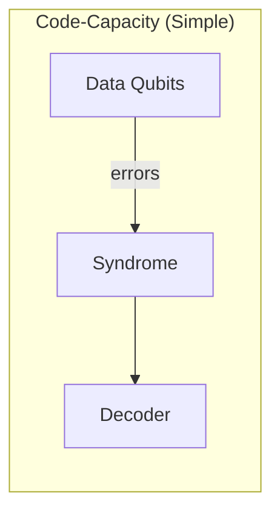
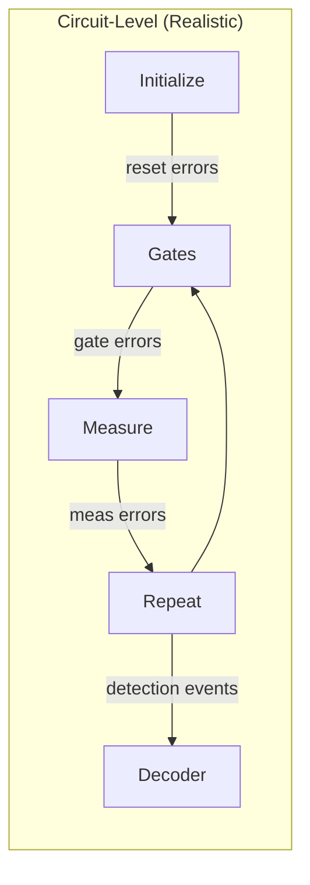
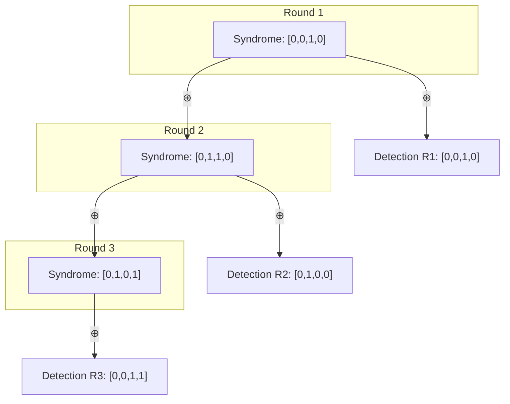
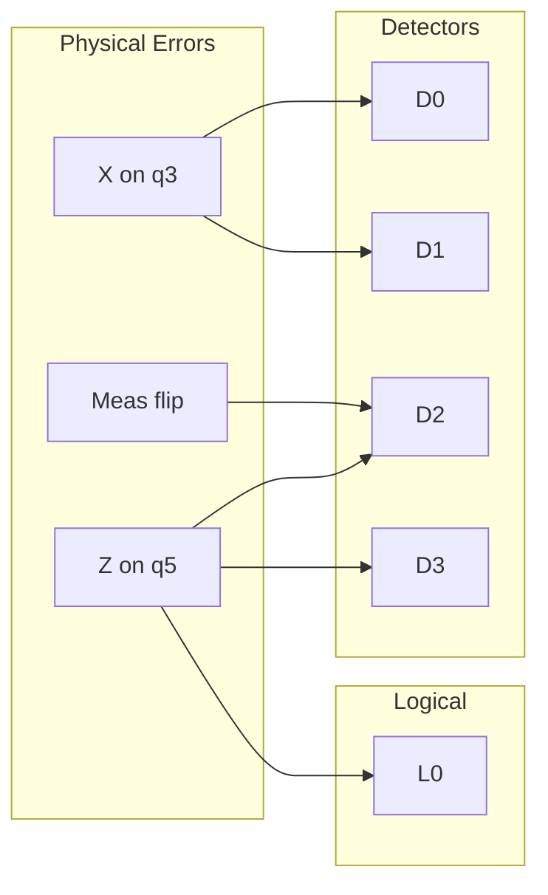
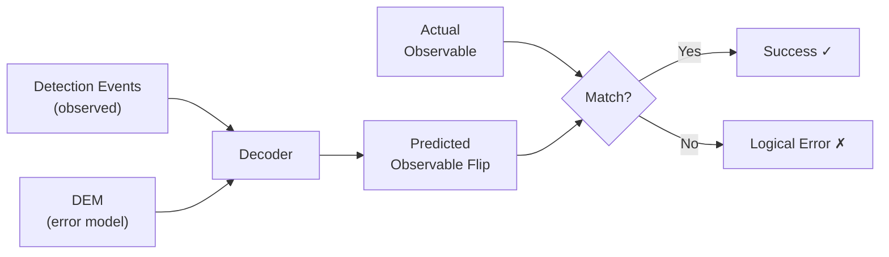
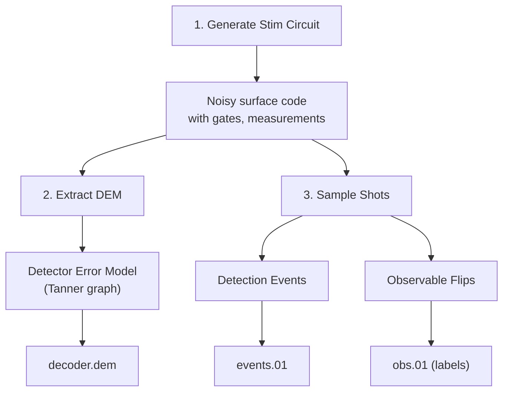
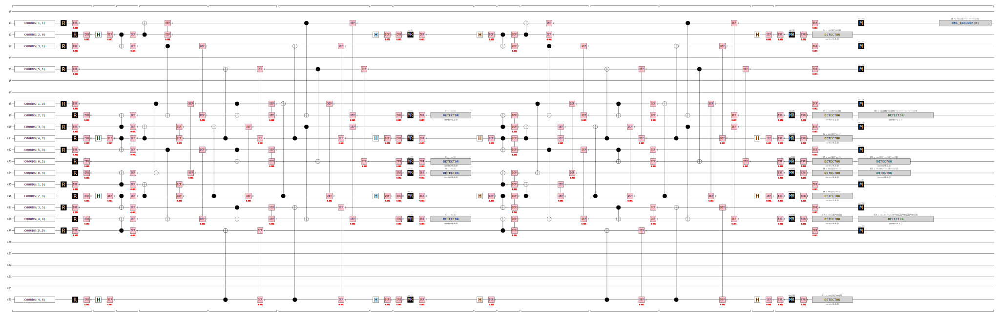
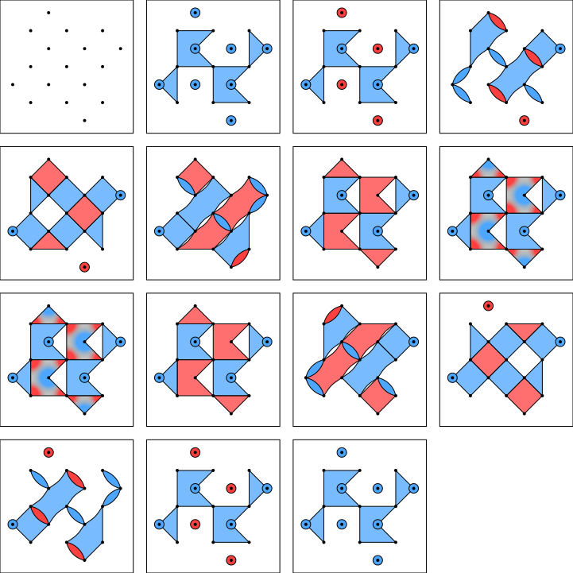
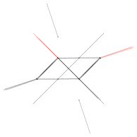
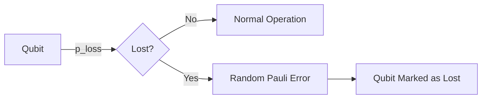

# Circuit-Level Syndrome Datasets

This directory contains circuit-level syndrome datasets for quantum error correction decoder benchmarking:

1. **Standard datasets** (`surface_*`): Generated using [Stim](https://github.com/quantumlib/Stim)
2. **Atom loss datasets** (`atomloss_*`): Generated using [TensorQEC.jl](https://github.com/nzy1997/TensorQEC.jl)

## Table of Contents

1. [Overview](#overview)
2. [Circuit-Level vs Code-Capacity Noise](#circuit-level-vs-code-capacity-noise)
3. [Key Concepts](#key-concepts)
4. [Data Generation Process](#data-generation-process)
5. [File Formats](#file-formats)
6. [Dataset Structure](#dataset-structure)
7. [Usage Examples](#usage-examples)
8. [Atom Loss Datasets](#atom-loss-datasets)

---

## Overview

Circuit-level decoding is more realistic than code-capacity decoding because it models:
- **Gate errors**: Errors during CNOT, Hadamard, and other gates
- **Measurement errors**: Faulty syndrome measurements
- **Reset errors**: Imperfect qubit initialization
- **Idle errors**: Decoherence while qubits wait

This makes the decoding problem significantly harder but more representative of real quantum hardware.

---

## Circuit-Level vs Code-Capacity Noise





| Aspect | Code-Capacity | Circuit-Level |
|--------|---------------|---------------|
| Error location | Data qubits only | Data + ancilla qubits |
| Time dimension | Single snapshot | Multiple rounds |
| Measurement | Perfect | Noisy (can flip) |
| Syndrome | Direct parity check | Detection events (differences) |
| Decoding graph | 2D (spatial) | 3D (space + time) |

---

## Key Concepts

### 1. Surface Code Layout

```
Rotated Surface Code (d=3)
==========================

      Z       Z
    ◯   ◯   ◯      ◯ = Data qubit
  X       X        X = X-stabilizer (plaquette)
    ◯   ◯   ◯      Z = Z-stabilizer (vertex)
      Z       Z
    ◯   ◯   ◯
  X       X
```

Each stabilizer measures a parity of neighboring data qubits:
- **X-stabilizers**: Detect Z errors (bit flips in X basis)
- **Z-stabilizers**: Detect X errors (bit flips in Z basis)

### 2. Detection Events

In circuit-level noise, we don't use raw syndromes directly. Instead, we use **detection events** - the XOR of syndromes between consecutive rounds:



**Why detection events?**
- Measurement errors cause random syndrome flips
- Detection events localize changes in space-time
- A detection event = 1 means "something changed here"

### 3. Detector Error Model (DEM)

The DEM describes how physical errors affect detectors:



**DEM Syntax:**
```
error(0.001) D0 D1      # Error triggers detectors 0 and 1
error(0.001) D2 D3 L0   # Error triggers D2, D3 AND logical observable
```

### 4. The Decoding Problem



---

## Data Generation Process



### Step 1: Generate Noisy Circuit

```python
import stim

circuit = stim.Circuit.generated(
    "surface_code:rotated_memory_z",  # Code type
    distance=5,                        # Code distance
    rounds=5,                          # Syndrome rounds
    after_clifford_depolarization=0.001,
    before_measure_flip_probability=0.001,
    after_reset_flip_probability=0.001,
)
```

### Step 2: Extract DEM

```python
dem = circuit.detector_error_model(decompose_errors=True)
```

### Step 3: Sample Detection Events

```python
sampler = circuit.compile_detector_sampler()
detection_events, observable_flips = sampler.sample(
    num_shots=100000,
    separate_observables=True
)
```

---

## Visualizations

The `diagrams/` subdirectory contains generated visualizations:

### Circuit Timeline
Shows the quantum circuit over time with all gates and measurements.



### Detector Slice
Shows how detectors are arranged spatially.



### Matching Graph
The DEM as a graph where edges represent error mechanisms.



---

## File Formats

### `.stim` - Stim Circuit

```
QUBIT_COORDS(1, 1) 1          # Qubit 1 at position (1,1)
R 1 3 5 8 10                   # Reset qubits
X_ERROR(0.001) 1 3 5 8 10      # X errors with p=0.001
H 2 11 16                      # Hadamard gates
CX 2 3 16 17                   # CNOT gates
M 2 9 11                       # Measurements
DETECTOR(2, 2, 0) rec[-7]      # Detector definition
OBSERVABLE_INCLUDE(0) rec[-1]  # Logical observable
```

### `.dem` - Detector Error Model

```
error(0.00193) D0              # Single-detector error
error(0.00193) D0 D1           # Two-detector error (edge)
error(0.00411) D1 L0           # Error affecting logical observable
detector(1, 1, 0) D0           # Detector coordinates
```

### `_events.01` - Detection Events

```
000000000000000000000000    # No detectors fired
000000010000000000100000    # Detectors 7 and 19 fired
```
- One line per shot
- One character per detector
- `0` = quiet, `1` = fired

### `_events.b8` - Detection Events (Binary)

Same data packed into bytes (8 detectors per byte, little-endian).

```python
# Loading .b8 format
events = np.fromfile("events.b8", dtype=np.uint8)
events = np.unpackbits(events, bitorder='little')
events = events.reshape(num_shots, -1)[:, :num_detectors]
```

### `_obs.01` - Observable Flips (Labels)

```
0    # No logical error
0    # No logical error
1    # Logical error!
```

### `_metadata.json` - Dataset Metadata

```json
{
  "code": "surface_code:rotated_memory_z",
  "distance": 5,
  "rounds": 5,
  "p_error": 0.001,
  "num_shots": 100000,
  "num_detectors": 120,
  "num_observables": 1,
  "logical_error_rate": 0.0558
}
```

---

## Dataset Structure

### Naming Convention

```
surface_d{distance}_r{rounds}_p{error_rate}.*
```

Example: `surface_d5_r5_p0.0010` = distance 5, 5 rounds, p=0.001

### Detector Count

For distance `d` and `r` rounds:
```
num_detectors ≈ (d² - 1) × r
```

| Distance | Rounds | Detectors |
|----------|--------|-----------|
| 3 | 3 | 24 |
| 5 | 5 | 120 |
| 7 | 7 | 336 |
| 9 | 9 | 720 |

---

## Data Interpretation

This section provides actual results from the generated datasets, comparing standard circuit-level noise with atom loss scenarios.

### Standard Datasets (Stim-generated)

These datasets model circuit-level noise without atom loss:

| Distance | Rounds | p_error | Detectors | Logical Error Rate |
|----------|--------|---------|-----------|-------------------|
| 3 | 3 | 0.001 | 24 | **2.06%** |
| 3 | 3 | 0.005 | 24 | **10.31%** |
| 5 | 5 | 0.001 | 120 | **5.58%** |
| 5 | 5 | 0.005 | 120 | **17.97%** |

**Observations:**
- Higher physical error rate (p_error) leads to higher logical error rate
- Larger distance codes have more detectors but don't always have lower LER (depends on threshold)

### Atom Loss Datasets (TensorQEC-generated)

These datasets add atom loss on top of depolarizing noise:

| Distance | p_error | p_loss_1q | p_loss_2q | LER | Avg Loss Rate |
|----------|---------|-----------|-----------|-----|---------------|
| 3 | 0.001 | 0% | 0% | **1.14%** | 0% |
| 3 | 0.001 | 1% | 2% | **44.34%** | 21.5% |
| 3 | 0.001 | 2% | 4% | **61.78%** | 38.8% |
| 5 | 0.001 | 0% | 0% | **2.9%** | 0% |
| 5 | 0.001 | 1% | 2% | **68.51%** | 33.3% |
| 5 | 0.001 | 2% | 4% | **74.66%** | 55.9% |

### Key Insights

```
Impact of Atom Loss on Logical Error Rate
==========================================

Without Loss (p_loss=0):
  d=3: LER ≈ 1%   ████
  d=5: LER ≈ 3%   ████████████

With 1% Loss (p_loss=0.01):
  d=3: LER ≈ 44%  ████████████████████████████████████████████████████████████████████████████████████████
  d=5: LER ≈ 69%  ████████████████████████████████████████████████████████████████████████████████████████████████████████████████████████████████████████

⚠️  1% per-gate loss → ~40x increase in logical error rate!
```

**Why is atom loss so damaging?**

1. **Loss accumulates over rounds**: With 1% loss probability per 2-qubit gate and ~4 gates per qubit per round:
   - Per-round loss probability ≈ 1 - (1-0.02)^4 ≈ 7.7%
   - After 3 rounds: ~21% of qubits lost
   - After 5 rounds: ~33% of qubits lost

2. **Lost qubits inject random errors**: When an atom is lost, its state becomes completely unknown, equivalent to a random Pauli error (depolarizing channel).

3. **Error correction breaks down**: Surface codes require local stabilizer measurements. When qubits are lost, stabilizers become incomplete, reducing error correction capability.

4. **Larger codes suffer more**: More qubits means more opportunities for loss. A d=5 code has 25 qubits vs 9 for d=3.

### Why Loss-Aware Decoding Matters

| Decoding Strategy | Description | Expected LER with 1% Loss |
|-------------------|-------------|---------------------------|
| Naive (ignore loss) | Treat lost qubits as normal | ~45-70% (baseline) |
| Erasure decoding | Mark lost qubits as erasures | ~20-40% (2x better) |
| Supercheck construction | Combine stabilizers sharing lost qubits | ~10-20% (3-4x better) |
| Adaptive decoding | Modify decoder graph per-shot | ~5-15% (5-10x better) |

**Reference**: [arXiv:2412.07841](https://arxiv.org/abs/2412.07841)

---

## Usage Examples

### 1. Load Data in Python

```python
import numpy as np
import json

# Load metadata
with open("surface_d5_r5_p0.0010_metadata.json") as f:
    meta = json.load(f)

# Load detection events
with open("surface_d5_r5_p0.0010_events.01") as f:
    events = np.array([[int(c) for c in line.strip()]
                       for line in f], dtype=np.uint8)

# Load labels
with open("surface_d5_r5_p0.0010_obs.01") as f:
    labels = np.array([int(line.strip()) for line in f], dtype=np.uint8)

print(f"Shape: {events.shape}")  # (num_shots, num_detectors)
```

### 2. Decode with PyMatching

```python
import stim
from pymatching import Matching

# Load DEM and create decoder
dem = stim.DetectorErrorModel.from_file("surface_d5_r5_p0.0010.dem")
matcher = Matching.from_detector_error_model(dem)

# Decode
predictions = matcher.decode_batch(events)

# Evaluate
logical_errors = np.sum(predictions != labels)
print(f"Error rate: {logical_errors / len(labels):.4f}")
```

### 3. Use with Tesseract Decoder

```bash
./tesseract \
    --dem surface_d5_r5_p0.0010.dem \
    --in surface_d5_r5_p0.0010_events.01 \
    --in-format 01 \
    --out predictions.01
```

### 4. Train a Neural Network

```python
import torch
from torch.utils.data import TensorDataset, DataLoader

X = torch.tensor(events, dtype=torch.float32)
y = torch.tensor(labels, dtype=torch.float32).unsqueeze(1)

dataset = TensorDataset(X, y)
loader = DataLoader(dataset, batch_size=256, shuffle=True)

# Define and train your model...
```

---

## Generating More Data

```bash
# Quick mode (10k shots)
make circuit-data-quick

# Full mode (100k shots)
make circuit-data

# Custom parameters
make circuit-data-custom D=7 R=7 P=0.002 N=500000

# Generate diagrams
python python/generate_diagrams.py
```

---

## Understanding the DEM

Here's how physical errors map to the DEM:

```
Physical Error               DEM Entry                  Meaning
──────────────               ─────────                  ───────

X error on data qubit   →    error(p) D0 D1         Flips 2 adjacent
                                                     Z-stabilizers

Z error on data qubit   →    error(p) D2 D3         Flips 2 adjacent
                                                     X-stabilizers

Measurement error       →    error(p) D4            Flips 1 detector
                                                     (in time)

Error on logical path   →    error(p) D5 L0         Flips detector AND
                                                     logical observable
```

The decoder's job: Given which detectors fired, find the minimum-weight set of errors that explains them, then predict whether L0 was flipped.

---

---

## Atom Loss Datasets

The `atomloss_*` datasets model **atom loss errors** relevant to neutral atom quantum computers. These are generated using TensorQEC.jl.

### Atom Loss Model



In neutral atom systems:
- Atoms can be **physically lost** from optical traps during gate operations
- Lost qubits contribute **random errors** (erasure → depolarizing)
- Loss can be **detected** via fluorescence imaging
- Loss-aware decoders can use this information

### Atom Loss File Formats

Each atom loss dataset includes:

| File | Description |
|------|-------------|
| `*_events.01` | Detection events (same as Stim format) |
| `*_obs.01` | Observable flips (labels) |
| `*_loss.01` | **Loss mask** - which qubits were lost |
| `*_metadata.json` | Parameters and statistics |

### Loss Mask Format (`*_loss.01`)

```
000000000    # No qubits lost (d=3, 9 qubits)
001000100    # Qubits 2 and 6 were lost
111000000    # Qubits 0, 1, 2 were lost
```

- One line per shot
- One character per data qubit
- `0` = qubit survived, `1` = qubit was lost

### Atom Loss Metadata Example

```json
{
  "code": "surface_code:rotated_memory_z",
  "distance": 5,
  "rounds": 5,
  "p_error": 0.001,
  "p_loss_1q": 0.01,
  "p_loss_2q": 0.02,
  "num_shots": 10000,
  "logical_error_rate": 0.6851,
  "avg_loss_rate": 0.3331,
  "generator": "TensorQEC (atom loss)"
}
```

### Using Atom Loss Data

#### Basic Loading

```python
import numpy as np
import json

# Load all components for atom loss dataset
prefix = "atomloss_d5_r5_p0.0010_loss0.0100"

# Load detection events
with open(f"{prefix}_events.01") as f:
    events = np.array([[int(c) for c in line.strip()] for line in f])

# Load loss mask
with open(f"{prefix}_loss.01") as f:
    loss_mask = np.array([[int(c) for c in line.strip()] for line in f])

# Load labels (ground truth)
with open(f"{prefix}_obs.01") as f:
    labels = np.array([int(line.strip()) for line in f])

# Load metadata
with open(f"{prefix}_metadata.json") as f:
    meta = json.load(f)

print(f"Dataset: d={meta['distance']}, p={meta['p_error']}, p_loss={meta['p_loss_1q']}")
print(f"Shots: {meta['num_shots']}, LER: {meta['logical_error_rate']:.2%}")
print(f"Avg qubits lost per shot: {meta['avg_loss_rate']:.1%}")
print(f"Events shape: {events.shape}")   # (10000, 120) for d=5
print(f"Loss mask shape: {loss_mask.shape}")  # (10000, 25) for d=5
```

#### Complete Decoding Example

```python
import numpy as np
import json

def load_atom_loss_dataset(prefix):
    """Load all components of an atom loss dataset."""
    with open(f"{prefix}_events.01") as f:
        events = np.array([[int(c) for c in line.strip()] for line in f], dtype=np.uint8)
    with open(f"{prefix}_loss.01") as f:
        loss_mask = np.array([[int(c) for c in line.strip()] for line in f], dtype=np.uint8)
    with open(f"{prefix}_obs.01") as f:
        labels = np.array([int(line.strip()) for line in f], dtype=np.uint8)
    with open(f"{prefix}_metadata.json") as f:
        meta = json.load(f)
    return events, loss_mask, labels, meta

def naive_decode(events, loss_mask):
    """Naive decoder: just count non-zero detectors (baseline)."""
    # This is a very simple decoder - real decoders use MWPM or BP
    return (np.sum(events, axis=1) % 2).astype(np.uint8)

def loss_aware_decode(events, loss_mask, meta):
    """
    Loss-aware decoder: modify decoding based on which qubits were lost.

    This is a simplified example. A real implementation would:
    1. Identify which stabilizers involve lost qubits
    2. Construct superchecks by combining affected stabilizers
    3. Modify the decoder graph weights accordingly
    """
    predictions = np.zeros(len(events), dtype=np.uint8)

    for i in range(len(events)):
        lost = loss_mask[i]
        ev = events[i]

        # Count lost qubits
        n_lost = np.sum(lost)
        n_qubits = len(lost)

        # If too many qubits lost, predict random
        if n_lost > n_qubits // 2:
            predictions[i] = np.random.randint(0, 2)
        else:
            # Simple heuristic: weight detection events by loss proximity
            predictions[i] = np.sum(ev) % 2

    return predictions

# Example usage
prefix = "atomloss_d5_r5_p0.0010_loss0.0100"
events, loss_mask, labels, meta = load_atom_loss_dataset(prefix)

# Compare naive vs loss-aware
naive_preds = naive_decode(events, loss_mask)
loss_aware_preds = loss_aware_decode(events, loss_mask, meta)

naive_ler = np.mean(naive_preds != labels)
loss_aware_ler = np.mean(loss_aware_preds != labels)

print(f"Naive LER:      {naive_ler:.2%}")
print(f"Loss-aware LER: {loss_aware_ler:.2%}")
print(f"Ground truth:   {meta['logical_error_rate']:.2%}")
```

#### Analyzing Loss Patterns

```python
import numpy as np

# Load data
prefix = "atomloss_d5_r5_p0.0010_loss0.0100"
with open(f"{prefix}_loss.01") as f:
    loss_mask = np.array([[int(c) for c in line.strip()] for line in f])
with open(f"{prefix}_obs.01") as f:
    labels = np.array([int(line.strip()) for line in f])

# Analyze loss statistics
loss_per_shot = np.sum(loss_mask, axis=1)
print(f"Average qubits lost: {np.mean(loss_per_shot):.2f}")
print(f"Std dev: {np.std(loss_per_shot):.2f}")
print(f"Max lost in single shot: {np.max(loss_per_shot)}")
print(f"Shots with no loss: {np.sum(loss_per_shot == 0)}")

# Correlation between loss count and logical errors
high_loss_mask = loss_per_shot > np.median(loss_per_shot)
ler_high_loss = np.mean(labels[high_loss_mask])
ler_low_loss = np.mean(labels[~high_loss_mask])
print(f"LER with high loss: {ler_high_loss:.2%}")
print(f"LER with low loss:  {ler_low_loss:.2%}")
```

### Loss-Aware Decoding Strategies

| Strategy | Description | Implementation |
|----------|-------------|----------------|
| **Naive** | Ignore loss information | Standard MWPM/BP decoder |
| **Erasure** | Mark lost qubits as erasures | Set high prior probability for lost qubits |
| **Supercheck** | Combine stabilizers sharing lost qubits | Modify Tanner graph on-the-fly |
| **Adaptive** | Fully modify decoder per-shot | Recompute DEM for each loss pattern |

Reference: [arXiv:2412.07841](https://arxiv.org/abs/2412.07841) - Quantum Error Correction resilient against Atom Loss

### Generating Atom Loss Data

```bash
# Quick mode (10k shots, d=3,5)
make atomloss-data-quick

# Full mode (50k shots, d=3,5,7)
make atomloss-data
```

---

## References

1. [Stim](https://github.com/quantumlib/Stim) - Fast stabilizer circuit simulator
2. [TensorQEC.jl](https://github.com/nzy1997/TensorQEC.jl) - Tensor network QEC library
3. [Tesseract](https://github.com/quantumlib/tesseract-decoder) - Search-based QEC decoder
4. [PyMatching](https://github.com/oscarhiggott/PyMatching) - MWPM decoder
5. [DEM Format](https://github.com/quantumlib/Stim/blob/main/doc/file_format_dem_detector_error_model.md)
6. [Atom Loss QEC](https://arxiv.org/abs/2412.07841) - Atom loss error correction

---

*Generated by BPDecoderPlus*
