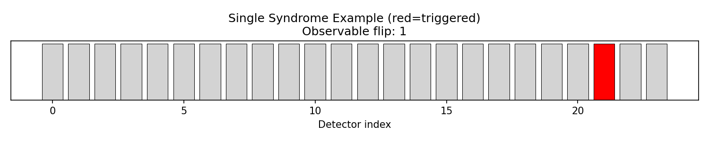

# Noisy Circuit Dataset (Surface Code, d=3)

Circuit-level surface-code memory experiments generated with Stim for **Belief Propagation (BP) decoding** demonstrations.

## Dataset Organization

All dataset files are in the root `datasets/` directory, organized by filename:

```
datasets/
├── README.md                      # This file
├── sc_d3_r3_p0010_z.stim         # Noisy quantum circuits
├── sc_d3_r5_p0010_z.stim
├── sc_d3_r7_p0010_z.stim
├── sc_d3_r3_p0010_z.dem          # Detector error models
├── sc_d3_r5_p0010_z.dem
├── sc_d3_r7_p0010_z.dem
├── sc_d3_r3_p0010_z.uai          # UAI format for probabilistic inference
├── sc_d3_r5_p0010_z.uai
├── sc_d3_r7_p0010_z.uai
├── sc_d3_r3_p0010_z.npz          # Syndrome databases
├── sc_d3_r5_p0010_z.npz
├── sc_d3_r7_p0010_z.npz
└── visualizations/                # Visualization files
    ├── sc_d3_layout.png           # Qubit layout
    ├── parity_check_matrix.png    # BP parity check matrix
    ├── syndrome_stats.png         # Detection event statistics
    └── single_syndrome.png        # Example syndrome pattern
```

## Overview

| Parameter | Value |
|-----------|-------|
| Code | Rotated surface code |
| Distance | d = 3 |
| Noise model | i.i.d. depolarizing |
| Error rate | p = 0.01 |
| Task | Z-memory experiment |
| Rounds | 3, 5, 7 |

### Noise Application Points
- Clifford gates (`after_clifford_depolarization`)
- Data qubits between rounds (`before_round_data_depolarization`)
- Resets (`after_reset_flip_probability`)
- Measurements (`before_measure_flip_probability`)

## Files

| File | Description |
|------|-------------|
| `sc_d3_r3_p0010_z.stim` | 3 rounds, p=0.01, Z-memory circuit |
| `sc_d3_r5_p0010_z.stim` | 5 rounds, p=0.01, Z-memory circuit |
| `sc_d3_r7_p0010_z.stim` | 7 rounds, p=0.01, Z-memory circuit |
| `sc_d3_r3_p0010_z.dem` | DEM for 3 rounds |
| `sc_d3_r5_p0010_z.dem` | DEM for 5 rounds |
| `sc_d3_r7_p0010_z.dem` | DEM for 7 rounds |
| `sc_d3_r3_p0010_z.uai` | UAI format for 3 rounds |
| `sc_d3_r5_p0010_z.uai` | UAI format for 5 rounds |
| `sc_d3_r7_p0010_z.uai` | UAI format for 7 rounds |
| `sc_d3_r3_p0010_z.npz` | Syndrome database for 3 rounds |
| `sc_d3_r5_p0010_z.npz` | Syndrome database for 5 rounds |
| `sc_d3_r7_p0010_z.npz` | Syndrome database for 7 rounds |
| `visualizations/sc_d3_layout.png` | Qubit layout visualization |
| `visualizations/parity_check_matrix.png` | BP parity check matrix H |
| `visualizations/syndrome_stats.png` | Detection event statistics |
| `visualizations/single_syndrome.png` | Example syndrome pattern |

## Qubit Layout

The surface code layout showing qubit positions (data + ancilla):


## Using This Dataset for BP Decoding

### Step 1: Load Circuit and Extract Detector Error Model (DEM)

The Detector Error Model is the key input for BP decoding. It describes which errors trigger which detectors.

```python
import stim
import numpy as np

# Load circuit
circuit = stim.Circuit.from_file("datasets/sc_d3_r3_p0010_z.stim")

# Extract DEM - this is what BP needs
dem = circuit.detector_error_model(decompose_errors=True)
print(f"Detectors: {dem.num_detectors}")      # 24
print(f"Error mechanisms: {dem.num_errors}")  # 286
print(f"Observables: {dem.num_observables}")  # 1
```

### Step 2: Build Parity Check Matrix H

BP operates on the parity check matrix where `H[i,j] = 1` means error `j` triggers detector `i`.

```python
def build_parity_check_matrix(dem):
    """Convert DEM to parity check matrix H and prior probabilities."""
    errors = []
    for inst in dem.flattened():
        if inst.type == 'error':
            prob = inst.args_copy()[0]
            dets = [t.val for t in inst.targets_copy() if t.is_relative_detector_id()]
            obs = [t.val for t in inst.targets_copy() if t.is_logical_observable_id()]
            errors.append({'prob': prob, 'detectors': dets, 'observables': obs})

    n_detectors = dem.num_detectors
    n_errors = len(errors)

    # Parity check matrix
    H = np.zeros((n_detectors, n_errors), dtype=np.uint8)
    # Prior error probabilities (for BP initialization)
    priors = np.zeros(n_errors)
    # Which errors flip the logical observable
    obs_flip = np.zeros(n_errors, dtype=np.uint8)

    for j, e in enumerate(errors):
        priors[j] = e['prob']
        for d in e['detectors']:
            H[d, j] = 1
        if e['observables']:
            obs_flip[j] = 1

    return H, priors, obs_flip

H, priors, obs_flip = build_parity_check_matrix(dem)
print(f"H shape: {H.shape}")  # (24, 286)
```

The parity check matrix structure:


### Step 3: Sample Syndromes (Detection Events)

```python
# Compile sampler
sampler = circuit.compile_detector_sampler()

# Sample detection events + observable flip
n_shots = 1000
samples = sampler.sample(n_shots, append_observables=True)

# Split into syndrome and observable
syndromes = samples[:, :-1]           # shape: (n_shots, n_detectors)
actual_obs_flips = samples[:, -1]     # shape: (n_shots,)

print(f"Syndrome shape: {syndromes.shape}")
print(f"Example syndrome: {syndromes[0]}")
```

### Step 4: BP Decoding (Pseudocode)

```python
def bp_decode(H, syndrome, priors, max_iter=50, damping=0.5):
    """
    Belief Propagation decoder (min-sum variant).

    Args:
        H: Parity check matrix (n_detectors, n_errors)
        syndrome: Detection events (n_detectors,)
        priors: Prior error probabilities (n_errors,)
        max_iter: Maximum BP iterations
        damping: Message damping factor

    Returns:
        estimated_errors: Most likely error pattern (n_errors,)
        soft_output: Log-likelihood ratios (n_errors,)
    """
    n_checks, n_vars = H.shape

    # Initialize LLRs from priors: LLR = log((1-p)/p)
    llr_prior = np.log((1 - priors) / priors)

    # Messages: check-to-variable and variable-to-check
    # ... BP message passing iterations ...

    # Hard decision
    estimated_errors = (soft_output < 0).astype(int)

    return estimated_errors, soft_output

# Decode each syndrome
for i in range(n_shots):
    syndrome = syndromes[i]
    estimated_errors, _ = bp_decode(H, syndrome, priors)

    # Predict observable flip
    predicted_obs_flip = np.dot(estimated_errors, obs_flip) % 2

    # Check if decoding succeeded
    success = (predicted_obs_flip == actual_obs_flips[i])
```

### Step 5: Evaluate Decoder Performance

After decoding, compare predicted vs actual observable flips to measure logical error rate.

```python
def evaluate_decoder(decoder_fn, circuit, n_shots=10000):
    """Evaluate decoder logical error rate."""
    dem = circuit.detector_error_model(decompose_errors=True)
    H, priors, obs_flip = build_parity_check_matrix(dem)

    sampler = circuit.compile_detector_sampler()
    samples = sampler.sample(n_shots, append_observables=True)
    syndromes = samples[:, :-1]
    actual_obs = samples[:, -1]

    errors = 0
    for i in range(n_shots):
        est_errors, _ = decoder_fn(H, syndromes[i], priors)
        pred_obs = np.dot(est_errors, obs_flip) % 2
        if pred_obs != actual_obs[i]:
            errors += 1

    return errors / n_shots

# logical_error_rate = evaluate_decoder(bp_decode, circuit)
```

## Syndrome Statistics

Detection event frequencies across 1000 shots (left) and baseline observable flip rate without decoding (right):


## Example Syndrome

A single syndrome sample showing which detectors fired (red = triggered):



## Regenerating the Dataset

```bash
# Install the package with uv
uv sync

# Generate circuits using the CLI
uv run generate-noisy-circuits \
  --distance 3 \
  --p 0.01 \
  --rounds 3 5 7 \
  --task z \
  --output datasets
```

## Extending the Dataset

```bash
# Different error rates
uv run generate-noisy-circuits --distance 3 --p 0.005 --rounds 3 5 7 --task z

# Different distances
uv run generate-noisy-circuits --distance 5 --p 0.01 --rounds 5 7 9 --task z

# X-memory experiment
uv run generate-noisy-circuits --distance 3 --p 0.01 --task x --rounds 3 5 7
```

## References

- [Stim Documentation](https://github.com/quantumlib/Stim)
- [BP+OSD Decoder Paper](https://arxiv.org/abs/2005.07016)
- [Surface Code Decoding Review](https://quantum-journal.org/papers/q-2024-10-10-1498/)
