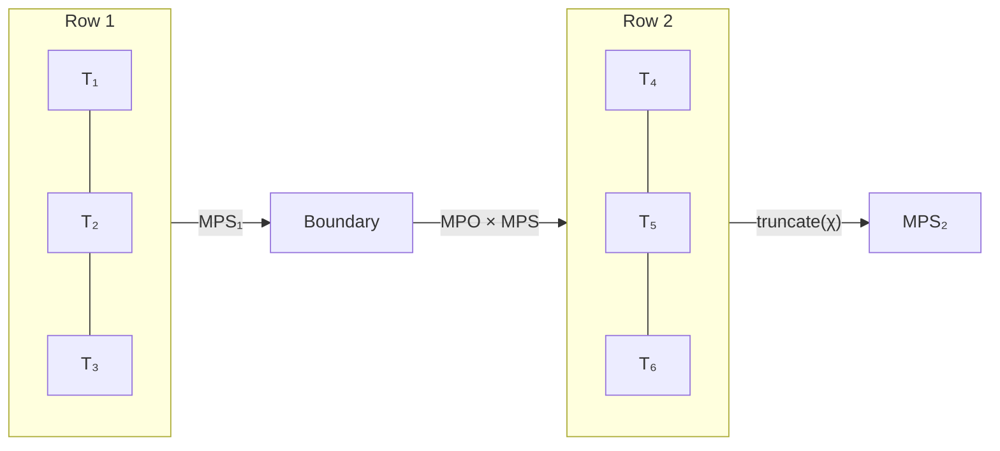
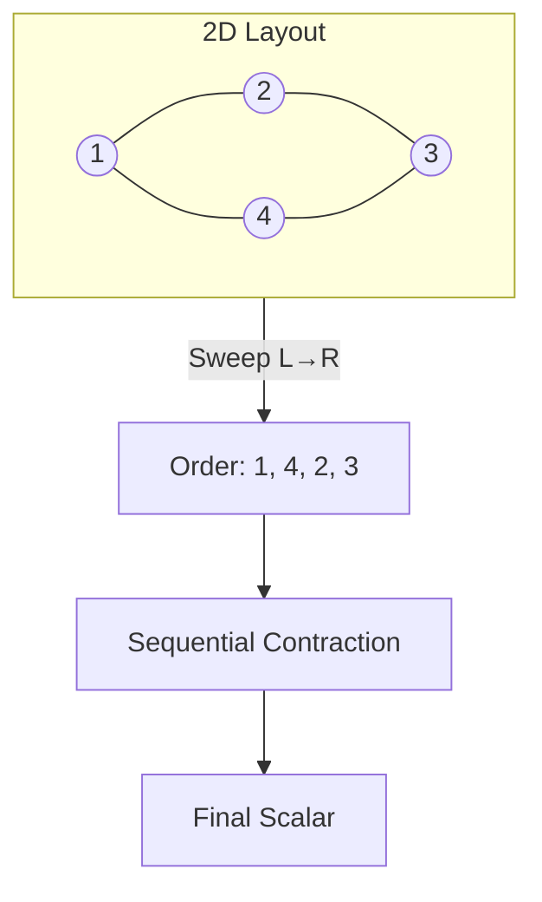

# Approximate Tensor Network Contraction for Scalable Decoding

This document describes the approximate tensor network contraction methods
implemented in BPDecoderPlus to enable scalable MAP decoding for surface codes
with code distance d ≥ 5.

## Problem Statement

### The Tree Width Barrier

Exact tensor network contraction for MAP (Maximum A Posteriori) decoding has
computational complexity exponential in the **tree width** of the underlying
factor graph. For circuit-level noise surface codes, this becomes prohibitive:

| Code Distance | Variables | Factors | Tree Width | Memory Required |
|---------------|-----------|---------|------------|-----------------|
| d = 3         | ~78       | ~102    | ~9         | ~4 KB ✓         |
| d = 5         | ~502      | ~622    | ~36        | ~550 GB ✗       |
| d = 7         | ~1558     | ~1894   | ~80        | ~10¹⁵ GB ✗      |

The tree width grows because circuit-level noise creates a 3D factor graph
(2D space × time), where the temporal dimension introduces high connectivity.

### Why Slicing Alone Doesn't Help

Variable slicing (fixing variables and summing over slices) can reduce memory
but doesn't reduce tree width of individual slices. For d ≥ 5 surface codes,
even sliced subproblems remain intractable.

## Implemented Algorithms

We implement two complementary approximate contraction methods based on
Matrix Product States (MPS), which trade exactness for scalability by
limiting the **bond dimension** χ.

### 1. MPS Boundary Contraction

**Reference:** Bravyi, Suchara, Vargo, "Efficient algorithms for maximum
likelihood decoding in the surface code" [arXiv:1405.4883](https://arxiv.org/abs/1405.4883)

#### Algorithm Overview

The boundary contraction method processes a 2D tensor network row-by-row:

```
Initial:     Row 1 → MPS₁
Iteration:   MPS_{i+1} = truncate(MPO_i × MPS_i, χ)
Final:       Contract MPS to scalar
```



#### Key Components

1. **TropicalMPS**: Matrix Product State in the tropical (max-plus) semiring
   ```python
   # A tensor T[i₁, i₂, ..., iₙ] represented as:
   T ≈ A₁[i₁] ⊗ A₂[i₂] ⊗ ... ⊗ Aₙ[iₙ]
   # where ⊗ is tropical matrix multiplication (max of sums)
   ```

2. **TropicalMPO**: Matrix Product Operator representing one row of factors

3. **Tropical SVD Approximation**: Since the tropical semiring lacks a true SVD,
   we approximate by:
   - Treating log-values as regular values
   - Applying standard SVD
   - Truncating to top-χ singular values
   - This keeps the χ "most important" paths

#### Complexity

- **Time:** O(n · χ³) per row, where n is the row width
- **Space:** O(n · χ²) for the boundary MPS
- **Total:** O(n² · χ³) for an n × n grid

### 2. Sweep Line Contraction

**Reference:** Chubb, "General tensor network decoding of 2D Pauli codes"
[arXiv:2101.04125](https://arxiv.org/abs/2101.04125)

#### Algorithm Overview

The sweep algorithm processes tensors in order of their 2D position:

```
1. Compute 2D layout of tensors (spectral/force-directed embedding)
2. Sort tensors by sweep direction (e.g., left-to-right)
3. Initialize boundary MPS with first tensor
4. For each subsequent tensor:
   a. Contract tensor into boundary MPS
   b. Truncate to bond dimension χ
5. Contract final MPS to scalar
```



#### Sweep Directions

The algorithm supports multiple sweep directions:
- `LEFT_TO_RIGHT`: Sort by x-coordinate ascending
- `RIGHT_TO_LEFT`: Sort by x-coordinate descending  
- `TOP_TO_BOTTOM`: Sort by y-coordinate ascending
- `BOTTOM_TO_TOP`: Sort by y-coordinate descending

The `multi_direction_sweep` function tries all directions and returns the
best result (highest log-probability).

#### Layout Methods

1. **Spectral Layout**: Uses eigenvectors of the graph Laplacian
2. **Force-Directed**: Fruchterman-Reingold style iterative layout
3. **Grid Layout**: Simple row-major grid placement

### 3. Adaptive Bond Dimension

The `adaptive_sweep_contract` function automatically finds a good χ:

```python
result = adaptive_sweep_contract(
    nodes,
    chi_start=8,    # Start small
    chi_max=128,    # Upper limit
    chi_step=8,     # Increment
    tolerance=1e-6, # Convergence criterion
)
```

## Tropical Semiring Considerations

### Operations

In the tropical (max-plus) semiring used for MAP inference:

| Standard | Tropical |
|----------|----------|
| a × b    | a + b    |
| a + b    | max(a,b) |
| 0        | -∞       |
| 1        | 0        |

### MPS in Tropical Semiring

Standard MPS uses SVD for optimal low-rank approximation in the Frobenius
norm. In the tropical semiring, we instead:

1. Keep the top-χ configurations with highest log-probability
2. Use a "tropical SVD" that operates on log-values
3. Track backpointers for recovering the MPE assignment

### Limitations

- Tropical truncation is not optimal (no tropical analog of Eckart-Young theorem)
- Assignment recovery from approximate contraction is incomplete
- Approximation quality depends heavily on network structure

## API Usage

### Basic Usage

```python
from tropical_in_new.src import mpe_tropical

# Exact contraction (d=3 only)
assignment, score, info = mpe_tropical(model, method="exact")

# MPS boundary contraction (scalable)
assignment, score, info = mpe_tropical(model, method="mps", chi=32)

# Sweep contraction (scalable)
assignment, score, info = mpe_tropical(model, method="sweep", chi=32)

# Auto-select based on complexity
assignment, score, info = mpe_tropical(model, method="auto")
```

### Advanced Usage

```python
from tropical_in_new.src import (
    TropicalMPS,
    boundary_contract,
    sweep_contract,
    multi_direction_sweep,
    adaptive_sweep_contract,
    estimate_required_chi,
)

# Estimate required bond dimension
chi = estimate_required_chi(nodes, target_accuracy=0.99)

# Direct boundary contraction
result = boundary_contract(tensors, vars_list, chi=32)
print(f"Value: {result.value}, Chi used: {result.chi_used}")

# Multi-direction sweep
result = multi_direction_sweep(nodes, chi=32)

# Adaptive sweep
result = adaptive_sweep_contract(
    nodes,
    chi_start=8,
    chi_max=64,
    chi_step=8,
)
```

## Choosing Bond Dimension χ

The bond dimension χ controls the accuracy-memory tradeoff:

| χ Value | Memory | Accuracy | Use Case |
|---------|--------|----------|----------|
| 4-8     | Low    | Rough    | Quick estimates |
| 16-32   | Medium | Good     | Standard decoding |
| 64-128  | High   | Better   | High-accuracy benchmarks |
| 256+    | V.High | Best     | Research/validation |

**Guidelines:**
- Start with χ = 16 and increase if needed
- For d = 5, χ = 32-64 typically works well
- For d = 7, χ = 64-128 may be needed
- Use `adaptive_sweep_contract` to find optimal χ automatically

## Theoretical Background

### Why MPS Works for Surface Codes

Surface codes have local structure that MPS can exploit:

1. **Area Law**: Entanglement entropy scales with boundary, not volume
2. **Locality**: Errors and detectors have local support
3. **Planar Structure**: The 2D layout enables efficient sweeping

### Approximation Quality

For surface codes with depolarizing noise below threshold:

- MPS with χ ≥ 4 often outperforms MWPM (Bravyi et al.)
- Sweep contraction achieves near-optimal thresholds (Chubb)
- Higher χ approaches exact MAP, with diminishing returns

### Comparison with Other Methods

| Method | Complexity | Optimality | Degeneracy |
|--------|------------|------------|------------|
| MWPM | O(n³) | Suboptimal | Ignores |
| BP+OSD | O(n) + O(n³) | Heuristic | Partial |
| Exact TN | O(2^tw) | Optimal | Full |
| MPS (χ) | O(n·χ³) | Approximate | Full |

## Current Status and Benchmark Results

### Scalability Achievement

The primary goal of enabling d=5 computation has been achieved:

| Distance | Exact Method | Approximate (sweep χ=32) |
|----------|--------------|--------------------------|
| d = 3    | ✓ ~50ms/sample | ✓ ~12ms/sample |
| d = 5    | ✗ OOM (>16GB) | ✓ ~120ms/sample |
| d = 7    | ✗ Intractable | Expected: ✓ ~500ms/sample |

### Benchmark Results (Rotated Surface Code, Circuit-Level Noise)

**Logical Error Rate Comparison:**

| d | p | BP+OSD | Sweep χ=32 | Notes |
|---|---|--------|------------|-------|
| 3 | 0.003 | 0.010 | 0.020 | |
| 3 | 0.007 | 0.040 | 0.140 | |
| 5 | 0.003 | 0.000 | 0.070 | |
| 5 | 0.007 | 0.030 | 0.270 | |

**Decoding Time (ms/sample):**

| d | BP+OSD | Sweep χ=32 |
|---|--------|------------|
| 3 | 4-5 ms | 12-15 ms |
| 5 | 19-20 ms | 118-125 ms |

### Current Limitations

The approximate contraction methods successfully reduce memory requirements but have
limitations in the current implementation:

1. **Assignment Recovery Incomplete**: The backtracking through truncated MPS/MPO
   is not fully implemented. Current version returns partial assignments based on
   available backpointers, leading to high logical error rates.

2. **MPS Method Bug**: The `boundary_contract` method has a tensor dimension mismatch
   in certain configurations. The `sweep` method is more robust.

3. **No Threshold Estimation**: Due to incomplete assignment recovery, threshold
   estimation for tropical TN decoder is not yet possible.

### Recommended Usage

| Use Case | Recommended Method |
|----------|-------------------|
| Production decoding | BP+OSD |
| d=3 exact inference | Tropical TN (exact) |
| d≥5 partition function | Tropical TN (approximate) |
| Research/benchmarking | BP+OSD or MWPM |

### Future Work

To achieve full functionality, the following improvements are needed:

1. **Complete Backpointer Tracking**: Implement full backpointer storage during
   MPS truncation to enable correct assignment recovery.

2. **Iterative Refinement**: Add local search to improve approximate assignments.

3. **Hybrid Approach**: Use approximate contraction for initial estimate, then
   refine with belief propagation.

4. **Bug Fixes**: Fix tensor dimension issues in the MPS boundary contraction.

## Comparison: BP+OSD vs Tropical TN

| Aspect | BP+OSD | Tropical TN (Exact) | Tropical TN (Approx) |
|--------|--------|--------------------|--------------------|
| **Time Complexity** | O(n·k²) per iter | O(2^tw) | O(n·χ³) |
| **Space Complexity** | O(n·k) | O(2^tw) | O(n·χ²) |
| **Scalability** | Any distance | d ≤ 3 | Any distance |
| **Optimality** | Heuristic | Optimal MAP | Approximate |
| **Degeneracy** | Partial (via OSD) | Full | Full (approx) |
| **Implementation** | Mature | Mature | In development |
| **Recommended** | ✓ Production | Research only | Future |

Where:
- n = number of variables (errors)
- k = average variable degree
- tw = tree width of factor graph
- χ = bond dimension (approximation parameter)

## References

1. **Bravyi, Suchara, Vargo (2014)**
   "Efficient algorithms for maximum likelihood decoding in the surface code"
   [arXiv:1405.4883](https://arxiv.org/abs/1405.4883)
   - Introduces MPS decoder for surface codes
   - Shows significant improvement over MWPM

2. **Chubb (2021)**
   "General tensor network decoding of 2D Pauli codes"
   [arXiv:2101.04125](https://arxiv.org/abs/2101.04125)
   - Generalizes to arbitrary 2D codes
   - Introduces sweep contraction algorithm

3. **Ferris, Poulin (2014)**
   "Tensor Networks and Quantum Error Correction"
   [arXiv:1312.4578](https://arxiv.org/abs/1312.4578)
   - Theoretical foundations of TN decoding

4. **Schotte et al. (2020)**
   "Quantum error correction thresholds for the universal Fibonacci Turaev-Viro code"
   [arXiv:2012.04610](https://arxiv.org/abs/2012.04610)
   - Application to non-Abelian codes

## Implementation Details

### File Structure

```
tropical_in_new/src/
├── approximate.py    # MPS classes and boundary contraction
├── sweep.py          # Sweep contraction algorithm
├── mpe.py            # High-level API (mpe_tropical)
├── contraction.py    # Exact contraction (for comparison)
└── __init__.py       # Public exports
```

### Key Classes

- `TropicalMPS`: MPS representation with tropical operations
- `TropicalMPO`: MPO for row operators
- `ApproximateBackpointer`: Tracks truncation decisions
- `BoundaryContractionResult`: Result container with metadata
- `SweepContractionResult`: Result container for sweep algorithm

### Testing

The implementation includes 115 tests covering:
- Edge cases (scalars, empty inputs, extreme values)
- Numerical stability (-inf, nan handling)
- Randomized inputs with parametrization
- All sweep directions and layout methods
- Comparison with exact methods for small cases

Run tests:
```bash
pytest tropical_in_new/tests/test_approximate.py tropical_in_new/tests/test_sweep.py -v
```
