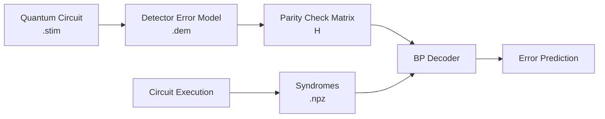
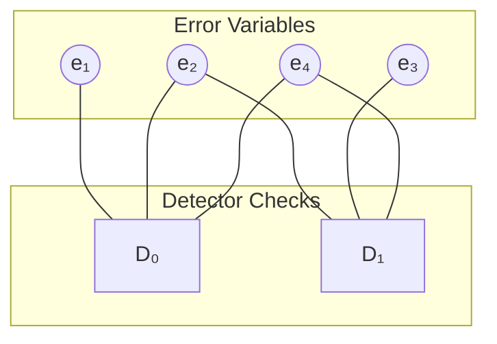
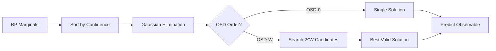

# Getting Started with BPDecoderPlus

This guide introduces quantum error correction decoding in ~15 minutes. We cover the problem, the pipeline, why standard BP fails, and how OSD fixes it.

---

## 1. The Decoding Problem

### What Are We Decoding?

Quantum error correction protects logical qubits by encoding them in many physical qubits. Errors happen continuously, so we periodically measure **syndrome bits** to detect them.

**The decoder's job:** Given syndrome measurements, infer what errors occurred and whether they flipped the logical qubit.

```
Physical errors → Syndrome measurements → Decoder → Logical error prediction
```

### Circuit-Level vs Code-Capacity Noise

| Model | Description | Realism |
|-------|-------------|---------|
| **Code-capacity** | Errors only on data qubits, perfect measurements | Simplified |
| **Circuit-level** | Errors on all operations, noisy measurements | Realistic |

BPDecoderPlus uses **circuit-level noise** — the realistic model where measurement operations themselves can fail.

### Detection Events (Not Raw Syndromes)

We don't directly use raw syndrome bits. Instead, we use **detection events**:

```
Detection event = syndrome[round t] ⊕ syndrome[round t-1]
```

A detection event fires (value = 1) when the syndrome **changes** between rounds. This indicates an error occurred nearby in space-time.

**Why detection events?**

- Raw syndromes are noisy (measurement errors)
- Detection events cancel measurement errors that persist across rounds
- Stim's detector error model (DEM) is defined in terms of detection events

---

## 2. Pipeline Overview

### The Complete Flow



### Key Components

| Step | Input | Output | Purpose |
|------|-------|--------|---------|
| 1. Generate Circuit | Parameters (d, r, p) | `.stim` file | Define noisy quantum operations |
| 2. Extract DEM | `.stim` circuit | `.dem` file | Map errors → detections |
| 3. Build H Matrix | `.dem` file | H, priors, obs_flip | Decoder input format |
| 4. Sample Syndromes | `.stim` circuit | `.npz` file | Training/test data |
| 5. Decode | H + syndromes | Predictions | Infer logical errors |

### The DEM: The Rulebook

The Detector Error Model (DEM) is the crucial link between physical errors and observable detection events:

```
error(0.01) D0 D5 L0
```

This entry means: *"There's a 1% probability of an error that triggers detectors 0 and 5, and flips the logical observable."*

The DEM completely specifies:

- **What errors can occur** (each line is one error mechanism)
- **Which detectors fire** (D0, D1, etc.)
- **Logical effect** (L0 means it flips the logical qubit)
- **Probability** (the number in parentheses)

---

## 3. Belief Propagation & Why It Fails

### Factor Graph from H Matrix

The parity check matrix H defines a **factor graph**:

- **Variable nodes**: Error mechanisms (columns of H)
- **Check nodes**: Detectors (rows of H)
- **Edges**: H[i,j] = 1 connects detector i to error j



### Message Passing Intuition

BP iteratively passes "beliefs" between nodes:

1. **Variable → Check**: "Here's my current probability of being 1"
2. **Check → Variable**: "Given what others told me, here's what you should be"
3. **Repeat** until convergence

After convergence, each variable has a **marginal probability** of being an error.

### The Degeneracy Problem

**BP works perfectly on trees, but quantum codes have loops!**

On loopy graphs, BP can:

- Fail to converge
- Converge to wrong probabilities
- Output invalid solutions (H · e ≠ syndrome)

**Most critically:** BP outputs probabilities, but rounding them doesn't guarantee a valid solution.


*BP's marginal probabilities (left) produce an invalid error pattern when thresholded at 0.5. The syndrome constraint H · e = s is violated.*

### Why Quantum Codes Are Hard

Classical LDPC codes: Each error has a unique syndrome signature.

Quantum surface codes: Multiple error patterns produce the **same syndrome** (degeneracy). BP gets "confused" by these equivalent solutions.

---

## 4. OSD Post-Processing

### The Key Insight

OSD (Ordered Statistics Decoding) forces a **unique, valid solution** by treating decoding as a system of linear equations:

```
H · e = s  (mod 2)
```

Given syndrome s, find error vector e that satisfies this constraint.

### OSD-0 Algorithm in 3 Steps

**Step 1: Sort columns by BP confidence**

```python
# Sort by how confident BP is (most confident first)
order = argsort(|LLR|, descending=True)
H_sorted = H[:, order]
```

**Step 2: Gaussian elimination**

```python
# Find linearly independent columns (pivot positions)
H_reduced, pivot_cols = row_reduce(H_sorted)
```

**Step 3: Solve the linear system**

```python
# Fix non-pivot variables to BP's hard decision
# Solve for pivot variables via back-substitution
e_pivot = solve(H_reduced, s - H_non_pivot @ e_non_pivot)
```

**Result:** A valid codeword that respects BP's confident decisions.

### OSD-W: Search for Better Solutions

OSD-0 fixes non-pivot bits to BP's decision. OSD-W searches over 2^W combinations of the W least confident non-pivot bits, picking the solution with lowest soft-weighted cost.



### The Fix in Action


*The same syndrome from above, now decoded correctly with OSD post-processing. OSD guarantees H · e = s.*

---

## 5. Live Demo

### Minimal Working Example

```python
from bpdecoderplus.circuit import generate_circuit
from bpdecoderplus.dem import extract_dem, build_parity_check_matrix
from bpdecoderplus.syndrome import sample_syndromes
from bpdecoderplus.batch_bp import BatchBPDecoder
from bpdecoderplus.batch_osd import BatchOSDDecoder
import torch
import numpy as np

# 1. Generate circuit and extract decoder inputs
circuit = generate_circuit(distance=3, rounds=3, p=0.01, task="z")
dem = extract_dem(circuit, decompose_errors=True)
H, priors, obs_flip = build_parity_check_matrix(dem)

# 2. Sample test syndromes
syndromes, observables = sample_syndromes(circuit, num_shots=1000)

# 3. Run BP + OSD decoder
bp_decoder = BatchBPDecoder(H, priors, device='cpu')
osd_decoder = BatchOSDDecoder(H, device='cpu')

marginals = bp_decoder.decode(torch.from_numpy(syndromes).float(), max_iter=20)
predictions = []
for i in range(len(syndromes)):
    e = osd_decoder.solve(syndromes[i], marginals[i].numpy(), osd_order=10)
    predictions.append(int(np.dot(e, obs_flip) % 2))

# 4. Evaluate
accuracy = np.mean(np.array(predictions) == observables)
print(f"Logical error rate: {1 - accuracy:.2%}")
```

Run with:
```bash
uv run python examples/minimal_example.py
```

### Threshold Results

The **threshold** is the physical error rate below which larger codes perform better. BP+OSD achieves near-optimal threshold:


| Decoder | Threshold | Notes |
|---------|-----------|-------|
| BP (damped) | NA | Fast, limited by graph loops |
| **BP+OSD** | ~0.7% | Near-optimal, slightly slower |
| MWPM | ~0.7% | Gold standard reference |

---

## Next Steps

1. **Try the minimal example**: `uv run python examples/minimal_example.py`
2. **Generate your own data**: See [Usage Guide](usage_guide.md) for CLI options
3. **Understand the math**: See [Mathematical Description](mathematical_description.md)
4. **Explore the API**: See [API Reference](api_reference.md)
