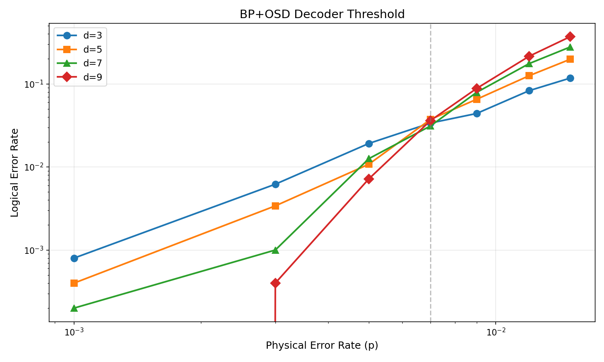
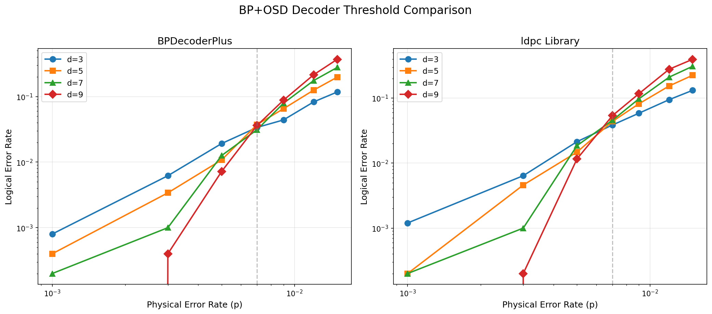
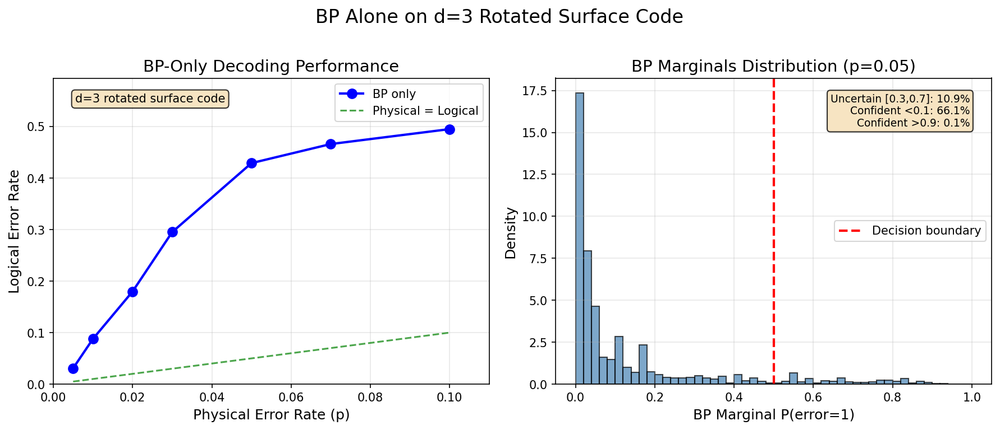
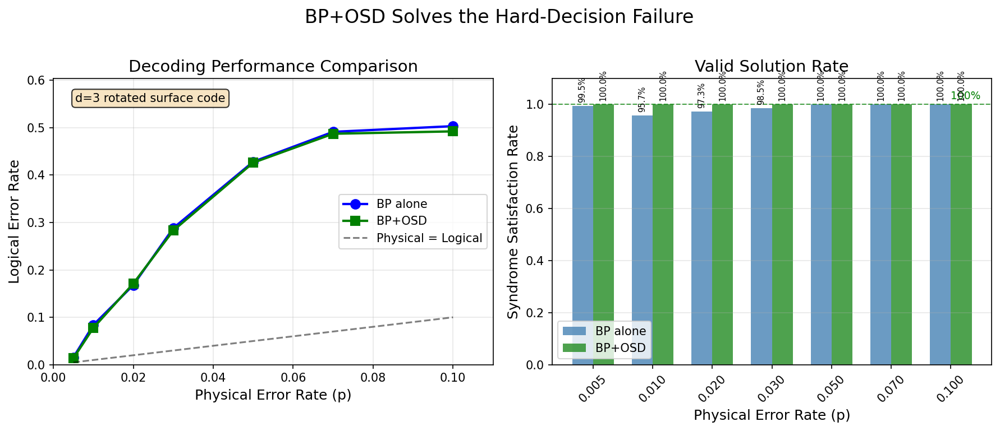

# Getting Started with BPDecoderPlus

## Overview

BPDecoderPlus generates training and test data for belief propagation (BP) decoding of quantum error correction codes. This guide shows you how to generate circuits, extract error models, and sample syndrome data - everything you need to train and test quantum error correction decoders.

## Quick Start

Generate a complete dataset with one command:

```bash
python -m bpdecoderplus.cli \
  --distance 3 \
  --p 0.01 \
  --rounds 3 \
  --task z \
  --generate-dem \
  --generate-uai \
  --generate-syndromes 1000
```

This creates files in organized subdirectories:
```
datasets/
├── circuits/sc_d3_r3_p0010_z.stim    # Noisy quantum circuit
├── dems/sc_d3_r3_p0010_z.dem         # Detector error model
├── uais/sc_d3_r3_p0010_z.uai         # UAI format for inference
└── syndromes/sc_d3_r3_p0010_z.npz    # 1000 syndrome samples
```

## Understanding the Pipeline

Data generation happens in four steps:

1. **Generate Noisy Circuit** - Creates a surface code circuit with realistic noise
2. **Extract Detector Error Model (DEM)** - Analyzes which errors trigger which detectors
3. **Convert to Inference Formats** - Exports DEM as .dem and .uai files
4. **Sample Syndromes** - Runs the circuit many times to generate training data

## Step-by-Step Guide

### Step 1: Generate Noisy Circuit

Create a quantum error correction circuit with realistic noise.

**Parameters:**
- `--distance` - Size of the surface code (3, 5, 7, etc.)
- `--rounds` - Number of error correction cycles
- `--p` - Physical error rate (e.g., 0.01 = 1% error per operation)
- `--task` - Type of logical operation ("z" for memory experiment)

**Example:**
```bash
python -m bpdecoderplus.cli --distance 3 --p 0.01 --rounds 3 --task z
```

**Output:** `datasets/circuits/sc_d3_r3_p0010_z.stim`

The `.stim` file contains the complete quantum circuit with:
- Qubit initialization
- Syndrome measurement operations
- Noise on every gate
- Logical observable measurement

### Step 2: Extract Detector Error Model (DEM)

The DEM tells us which errors trigger which syndrome detectors.

**Why we need it:**
The circuit describes quantum operations, but the decoder needs to know:
- What errors can occur? Decoder use it to decides what types of error it can output.
- Which detectors fire when each error happens? This eventually transformed into a decoder graph/tanner graph/Factor graph.
- Does the error flip the logical qubit? This used as a benchmark for logical error rate.

**Generate DEM:**
```bash
python -m bpdecoderplus.cli --distance 3 --p 0.01 --rounds 3 --task z --generate-dem
```

**Output:** `datasets/dems/sc_d3_r3_p0010_z.dem`

The `.dem` file contains entries like:
```
error(0.01) D0 D5 L0
```
This means: "There's a 1% chance of an error that triggers detectors 0 and 5, and flips the logical observable"

**Using in Python:**
```python
from bpdecoderplus.dem import extract_dem, build_parity_check_matrix
import stim

# Load circuit and extract DEM
circuit = stim.Circuit.from_file('datasets/circuits/sc_d3_r3_p0010_z.stim')
dem = extract_dem(circuit)

# Build parity check matrix for BP decoding
H, priors, obs_flip = build_parity_check_matrix(dem)
print(f"H matrix shape: {H.shape}")  # (24, 286) for d=3, r=3
```

The parity check matrix H is the mathematical representation needed for BP decoding:
- `H[i,j] = 1` if error j triggers detector i
- `priors[j]` = probability of error j occurring
- `obs_flip[j] = 1` if error j flips the logical observable

### Step 3: Generate UAI Format (Optional)

The UAI format enables probabilistic inference with tools like TensorInference.jl.

**What is UAI format?**
UAI (Uncertainty in Artificial Intelligence) is a standard format for representing probabilistic graphical models. It represents the DEM as a Markov network where:
- Each detector is a binary variable (0 or 1)
- Each error mechanism is a factor/clique
- Factor tables encode error probabilities

**Generate UAI:**
```bash
python -m bpdecoderplus.cli --distance 3 --p 0.01 --rounds 3 --task z --generate-uai
```

**Output:** `datasets/uais/sc_d3_r3_p0010_z.uai`

The `.uai` file structure:
```
MARKOV
24                    # Number of variables (detectors)
2 2 2 2 ...          # Each variable has 2 states (0 or 1)
286                   # Number of factors (error mechanisms)
1 0                   # Factor 1 involves detector 0
2 0 1                 # Factor 2 involves detectors 0 and 1
...
```

**Using UAI files:**
UAI files can be used with probabilistic inference tools for:
- Exact inference (partition function calculation)
- Marginal probability computation
- MAP (maximum a posteriori) inference
- Integration with TensorInference.jl for tensor network methods

### Step 4: Sample Syndromes

Generate training/test data by running the circuit many times.

**What happens:**
Each "shot" runs the full circuit:
1. Initialize qubits
2. Apply gates (errors occur randomly based on noise rate)
3. Measure syndromes (which detectors fire?)
4. Measure logical qubit (did it flip?)

**Generate syndromes:**
```bash
python -m bpdecoderplus.cli \
  --distance 3 --p 0.01 --rounds 3 --task z \
  --generate-syndromes 10000
```

**Output:** `datasets/syndromes/sc_d3_r3_p0010_z.npz`

The `.npz` file contains:
- `syndromes`: Binary array (num_shots × num_detectors)
- `observables`: Binary array (num_shots,) - 1 means logical error
- `metadata`: Circuit parameters (JSON)

**Loading syndrome data:**
```python
from bpdecoderplus.syndrome import load_syndrome_database

syndromes, observables, metadata = load_syndrome_database(
    'datasets/syndromes/sc_d3_r3_p0010_z.npz'
)

print(f"Syndromes shape: {syndromes.shape}")      # (10000, 24)
print(f"Observables shape: {observables.shape}")  # (10000,)
print(f"Metadata: {metadata}")
```

## Understanding the Data

### Syndromes (Detection Events)

Each row is a **syndrome** - a binary vector indicating which detectors fired:

```python
syndrome = syndromes[0]  # First shot
# Example: [0, 1, 1, 0, 0, 0, 1, 0, ...]
#           ↑  ↑  ↑           ↑
#           Detectors 1, 2, and 6 fired
```

**What does a detection event mean?**
- A detector fires (value = 1) when there's a change in the syndrome between consecutive measurement rounds
- This indicates an error occurred in that space-time region
- The decoder's job is to infer which errors caused these detection events

### Observables (Logical Outcomes)

Each observable value indicates whether the **logical qubit flipped**:

```python
observable = observables[0]  # First shot
# 0 = No logical error (decoder should predict 0)
# 1 = Logical error occurred (decoder should predict 1)
```

**Decoder success criterion:**
- Decoder predicts observable flip from syndrome
- If prediction matches actual observable → Success
- If prediction differs → Logical error

## Complete Example Workflow

### Generate all data at once

```bash
python -m bpdecoderplus.cli \
  --distance 3 \
  --p 0.01 \
  --rounds 3 5 7 \
  --task z \
  --generate-dem \
  --generate-uai \
  --generate-syndromes 10000
```

This creates a complete dataset for three different round counts:
```
datasets/
├── circuits/
│   ├── sc_d3_r3_p0010_z.stim
│   ├── sc_d3_r5_p0010_z.stim
│   └── sc_d3_r7_p0010_z.stim
├── dems/
│   ├── sc_d3_r3_p0010_z.dem
│   ├── sc_d3_r5_p0010_z.dem
│   └── sc_d3_r7_p0010_z.dem
├── uais/
│   ├── sc_d3_r3_p0010_z.uai
│   ├── sc_d3_r5_p0010_z.uai
│   └── sc_d3_r7_p0010_z.uai
└── syndromes/
    ├── sc_d3_r3_p0010_z.npz
    ├── sc_d3_r5_p0010_z.npz
    └── sc_d3_r7_p0010_z.npz
```

### Use in Python

```python
import numpy as np
from bpdecoderplus.dem import extract_dem, build_parity_check_matrix
from bpdecoderplus.syndrome import load_syndrome_database
import stim

# Load circuit and extract DEM
circuit = stim.Circuit.from_file('datasets/circuits/sc_d3_r3_p0010_z.stim')
dem = extract_dem(circuit)

# Build parity check matrix
H, priors, obs_flip = build_parity_check_matrix(dem)
print(f"H matrix shape: {H.shape}")  # (24, 286) for d=3, r=3

# Load syndrome data
syndromes, observables, metadata = load_syndrome_database(
    'datasets/syndromes/sc_d3_r3_p0010_z.npz'
)

# Ready for BP decoder!
# decoder = BPDecoder(H, priors, obs_flip)  # Coming soon
# predictions = decoder.decode(syndromes)
# accuracy = (predictions == observables).mean()
```

## Use Cases

### 1. Decoder Training

```python
# Load training data
syndromes, observables, _ = load_syndrome_database("train.npz")

# Train decoder
decoder.fit(syndromes, observables)
```

### 2. Decoder Evaluation

```python
# Load test data
syndromes, actual_obs, _ = load_syndrome_database("test.npz")

# Predict
predicted_obs = decoder.predict(syndromes)

# Evaluate
accuracy = (predicted_obs == actual_obs).mean()
logical_error_rate = 1 - accuracy
print(f"Logical error rate: {logical_error_rate:.4f}")
```

### 3. Decoder Comparison

```python
# Compare BP vs MWPM vs Neural decoder
for decoder in [bp_decoder, mwpm_decoder, neural_decoder]:
    predictions = decoder.predict(syndromes)
    error_rate = (predictions != observables).mean()
    print(f"{decoder.name}: {error_rate:.4f}")
```

## Advanced Usage

### Generate multiple noise levels

For comprehensive testing, generate data at different noise levels:

```bash
# Low noise
python -m bpdecoderplus.cli --distance 3 --p 0.001 --rounds 3 --task z \
  --generate-dem --generate-uai --generate-syndromes 10000

# Medium noise
python -m bpdecoderplus.cli --distance 3 --p 0.01 --rounds 3 --task z \
  --generate-dem --generate-uai --generate-syndromes 10000

# High noise
python -m bpdecoderplus.cli --distance 3 --p 0.05 --rounds 3 --task z \
  --generate-dem --generate-uai --generate-syndromes 10000
```

### Different code distances

```bash
# Small code (fast, lower threshold)
python -m bpdecoderplus.cli --distance 3 --p 0.01 --rounds 3 --task z \
  --generate-dem --generate-syndromes 10000

# Larger code (slower, higher threshold)
python -m bpdecoderplus.cli --distance 5 --p 0.01 --rounds 5 --task z \
  --generate-dem --generate-syndromes 10000
```

### Custom sampling

```python
from bpdecoderplus.syndrome import sample_syndromes, save_syndrome_database
import stim

# Load circuit
circuit = stim.Circuit.from_file("datasets/circuits/sc_d3_r3_p0010_z.stim")

# Sample with custom shots
syndromes, observables = sample_syndromes(circuit, num_shots=100000)

# Save with metadata
metadata = {"description": "Large training set", "purpose": "neural decoder"}
save_syndrome_database(
    syndromes, observables,
    "datasets/syndromes/large_train.npz",
    metadata
)
```

## Expected Performance

For a distance-3 surface code with p=0.01:

| Property | Expected Value |
|----------|---------------|
| Number of detectors | 24 (8 per round × 3 rounds) |
| Number of error mechanisms | ~286 |
| Detection event rate | 3-5% per detector |
| Observable flip rate | ~0.5-1% |
| Non-trivial syndromes | >90% |

The BP decoder should reduce the logical error rate by 3-10x compared to no decoding.

## File Format Reference

### Circuit File (.stim)
Contains quantum operations and noise model. Handled automatically by the package.

### DEM File (.dem)
Lists all error mechanisms and their effects:
```
error(0.01) D0 D1      # Error triggers detectors 0 and 1
error(0.01) D1 D2      # Error triggers detectors 1 and 2
error(0.01) D0 D2 L0   # Error triggers detectors 0, 2 and flips logical
```

### UAI File (.uai)
Markov network representation for probabilistic inference:
```
MARKOV                 # Network type
24                     # Number of variables
2 2 2 ...             # Variable cardinalities
286                    # Number of factors
1 0                    # Factor scopes
2 0 1
...
```

### Syndrome Database (.npz)
NumPy archive with three components:
```python
data = np.load('sc_d3_r3_p0010_z.npz')
syndromes = data['syndromes']      # Shape: (num_shots, num_detectors)
observables = data['observables']  # Shape: (num_shots,)
metadata = data['metadata']        # JSON string with parameters
```

## Troubleshooting

**Q: The command is slow**
A: Syndrome sampling is the slowest part. Start with fewer shots (e.g., 1000) for testing.

**Q: Files are large**
A: The .npz files scale with num_shots. Use 1000-10000 shots for development, more for final evaluation.

**Q: What's a good starting point?**
A: Use distance=3, rounds=3, p=0.01, and 10000 shots. This runs quickly and gives good statistics.

**Q: When should I use UAI format?**
A: Use UAI format if you want to:
- Integrate with TensorInference.jl or other probabilistic inference tools
- Perform exact inference or marginal probability calculations
- Use tensor network methods for decoding

## Benchmark Results

This section shows the performance benchmarks for the decoders included in BPDecoderPlus.

### Decoder Threshold Comparison

The threshold is the physical error rate below which increasing the code distance reduces the logical error rate. Our benchmarks compare BP and BP+OSD decoders:



The threshold plot shows logical error rate vs physical error rate for different code distances. Lines that cross indicate the threshold point.

### BP vs BP+OSD Comparison



BP+OSD (Ordered Statistics Decoding) significantly improves upon standard BP, especially near the threshold region.

### Decoding Examples

**BP Failure Case:**



This shows a case where standard BP fails to find the correct error pattern.

**OSD Success Case:**



The same syndrome decoded successfully with BP+OSD post-processing.

### Benchmark Summary

| Decoder | Threshold (approx.) | Notes |
|---------|---------------------|-------|
| BP (damped) | ~8% | Fast, but limited by graph loops |
| BP+OSD | ~10% | Higher threshold, slightly slower |
| MWPM (reference) | ~10.3% | Gold standard for comparison |

The BP+OSD decoder achieves near-MWPM performance while being more scalable to larger codes.

## Next Steps

1. **Generate your first dataset** using the Quick Start command
2. **Explore the data** by loading the .npz file and examining syndromes
3. **Experiment with different parameters** (distance, rounds, noise rate)
4. **Try the BP+OSD decoder** to evaluate decoder performance on your data

## References

- [Stim Documentation](https://github.com/quantumlib/Stim) - Circuit simulation and sampling
- [TensorInference.jl](https://tensorbfs.github.io/TensorInference.jl/) - UAI format and tensor network inference
- [Surface Code Decoding](https://quantum-journal.org/papers/q-2024-10-10-1498/) - Decoder review
- [BP+OSD Paper](https://arxiv.org/abs/2005.07016) - BP decoder with OSD post-processing

## Support

For issues or questions:
- Check test suite: `tests/test_*.py`
- See minimal example: `examples/minimal_example.py`
- Report issues: GitHub Issues
