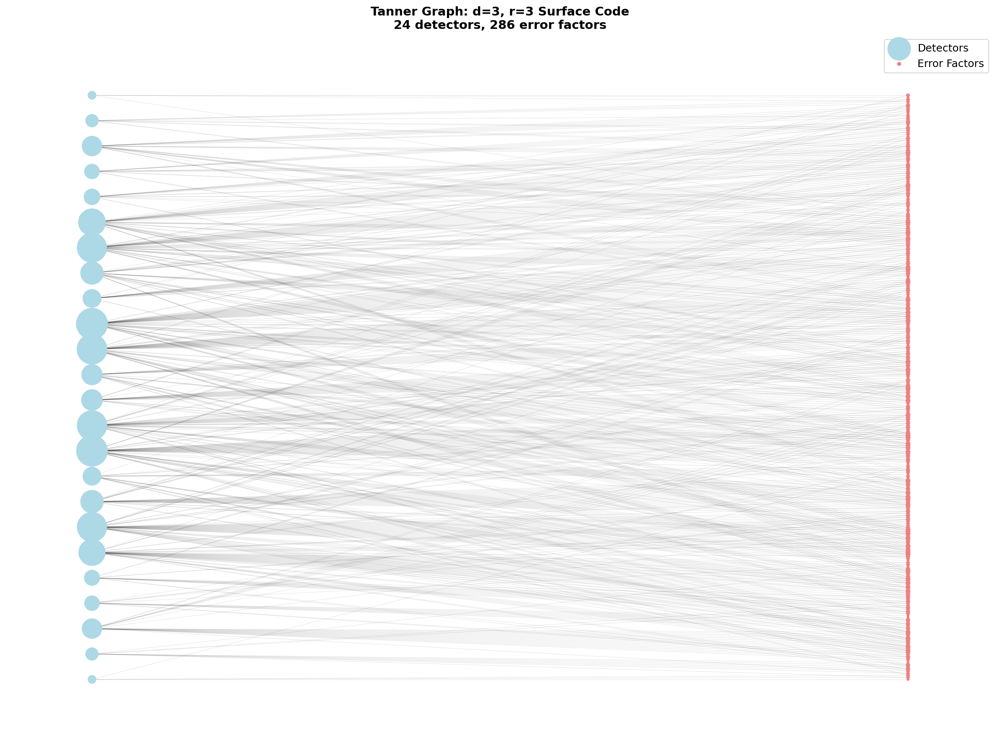
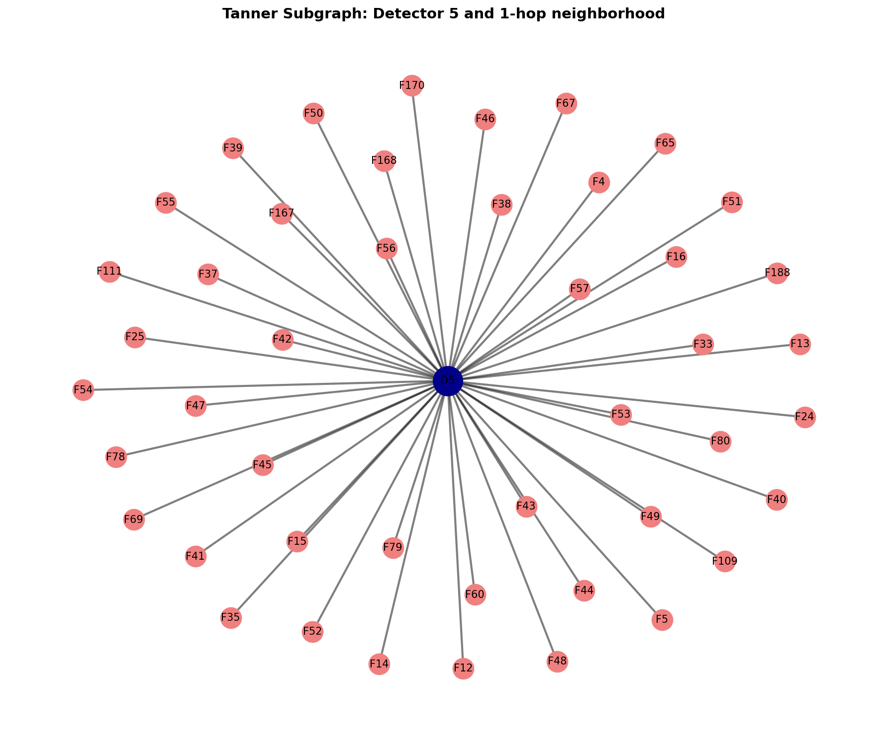
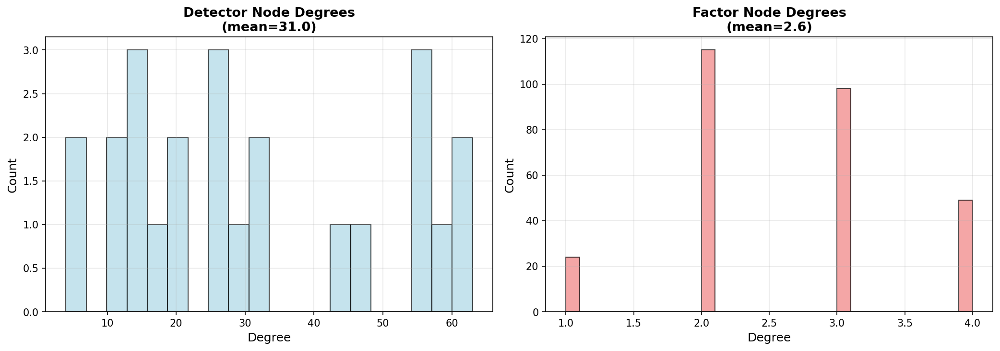
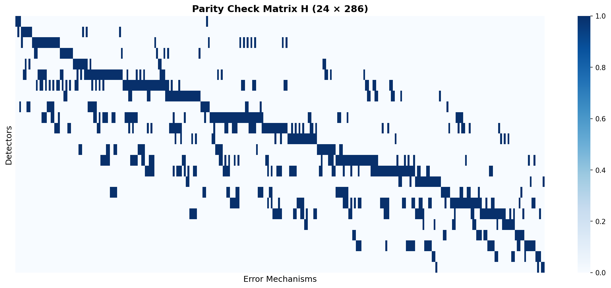
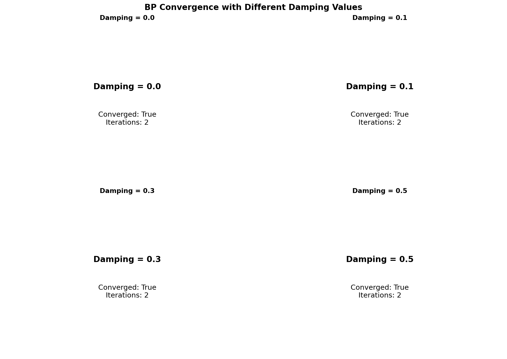
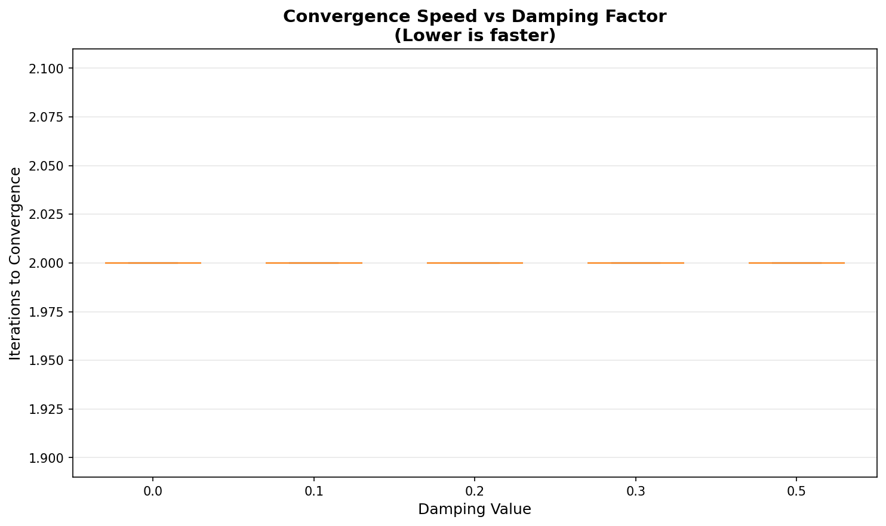

# Tanner Graph Walkthrough: Surface Code Decoding with Belief Propagation

## Introduction

This walkthrough demonstrates how to use `pytorch_bp` to decode quantum error correction codes using Tanner graphs and belief propagation. You'll learn the complete pipeline from surface code circuits to practical decoding, with hands-on examples using a d=3 surface code.

### What You'll Learn

- Tanner graph theory and how it represents error correction problems
- Building factor graphs from detector error models
- Running belief propagation for approximate inference
- Evaluating decoder performance with real syndrome data
- Tuning parameters for optimal convergence

### Prerequisites

- Basic understanding of quantum error correction (surface codes, stabilizers, syndromes)
- Python 3.10+ with NumPy basics
- Familiarity with probabilistic graphical models (helpful but not required)

### Dataset

We'll use the **d=3, r=3 surface code** dataset throughout this tutorial:

- **Distance (d):** 3 — can correct 1 error
- **Rounds (r):** 3 — syndrome measured 3 times
- **Physical error rate (p):** 0.01 — 1% per gate/measurement
- **Task:** Z-memory experiment

Files: `datasets/sc_d3_r3_p0010_z.{stim,dem,uai,npz}`

---

## Part 1: Tanner Graph Theory

### 1.1 What are Tanner Graphs?

A **Tanner graph** (also called a factor graph) is a bipartite graph used to represent constraints in error correction codes. It has two types of nodes:

1. **Variable nodes** — represent unknown quantities (detector outcomes)
2. **Factor nodes** — represent constraints (parity checks on errors)

For quantum error correction:

- **Variable nodes** = detectors (D0, D1, ..., D23 for d=3)
- **Factor nodes** = error mechanisms (which errors trigger which detectors)
- **Edges** = dependencies (H[i,j] = 1 means error j triggers detector i)

**Simple Example:**

Consider a parity check matrix:

$$
H = \begin{pmatrix}
1 & 1 & 0 \\\\
0 & 1 & 1
\end{pmatrix}
$$

This represents a Tanner graph with:

- 3 variable nodes (x₀, x₁, x₂) — error variables
- 2 check nodes (c₀, c₁) — parity constraints
- Edges: c₀ connects to {x₀, x₁}, c₁ connects to {x₁, x₂}

```
Variable nodes:    x₀    x₁    x₂
                    │  ╲  │  ╱  │
                    │   ╲ │ ╱   │
Check nodes:        c₀      c₁
```

### 1.2 From DEM to Tanner Graph

The Detector Error Model (DEM) describes which errors trigger which detectors. The parity check matrix H encodes this as a bipartite graph adjacency matrix.

For our **d=3, r=3 surface code**:

- **24 variable nodes** (detectors D0-D23)
- **286 factor nodes** (error mechanisms)
- **H matrix:** 24 × 286 binary matrix where H[i,j] = 1 means error j affects detector i

**Key quantities:**

- `H`: Parity check matrix (detector-error adjacency)
- `priors`: Error probabilities p(error j occurs)
- `obs_flip`: Which errors flip the logical observable (logical errors)

**Average node degree:**

- Detectors: ~12 connections (highly connected)
- Errors: ~2-3 connections (sparse)

This creates a **loopy graph** — cycles exist, making exact inference intractable. Belief propagation provides efficient approximate inference.

### 1.3 Message Passing Fundamentals

Belief Propagation (BP) is an iterative algorithm that passes "messages" along graph edges to compute marginal probabilities.

**Two types of messages:**

1. **Factor → Variable messages** (μ_{f→x}): Factor f's belief about variable x
2. **Variable → Factor messages** (μ_{x→f}): Variable x's aggregated belief excluding factor f

**Update equations:**

Factor to variable:
$$
\mu_{f \rightarrow x}(x) = \sum_{\\text{other vars}} \phi_f(...) \prod_{y \in ne(f) \setminus x} \mu_{y \rightarrow f}(y)
$$

Variable to factor:
$$
\mu_{x \rightarrow f}(x) = \prod_{g \in ne(x) \setminus f} \mu_{g \rightarrow x}(x)
$$

**Damping for loopy graphs:**

On graphs with cycles, BP can oscillate. Damping stabilizes convergence:

$$
\mu^{(t+1)} = \alpha \cdot \mu^{(t)} + (1-\alpha) \cdot \mu_{\\text{new}}
$$

where α ∈ [0, 1] is the damping factor (typical: 0.1-0.3).

**Belief computation:**

After convergence, marginal probabilities:

$$
P(x) \propto \prod_{f \in ne(x)} \mu_{f \rightarrow x}(x)
$$

---

## Part 2: Complete Pipeline Walkthrough

### 2.1 Load and Inspect Dataset

First, load the UAI model and DEM for analysis:

```python
from bpdecoderplus.pytorch_bp import read_model_file
from bpdecoderplus.dem import load_dem, build_parity_check_matrix

# Load UAI factor graph
model = read_model_file("datasets/sc_d3_r3_p0010_z.uai")
print(f"Variables (detectors): {model.nvars}")  # 24
print(f"Factors (error mechanisms): {len(model.factors)}")  # 286

# Load DEM and build H matrix
dem = load_dem("datasets/sc_d3_r3_p0010_z.dem")
H, priors, obs_flip = build_parity_check_matrix(dem)

print(f"H matrix shape: {H.shape}")  # (24, 286)
print(f"Errors that flip observable: {obs_flip.sum()}")
```

**Output:**
```
Variables (detectors): 24
Factors (error mechanisms): 286
H matrix shape: (24, 286)
Errors that flip observable: 143/286
```

**What this means:**

- 24 binary detector variables (syndrome bits)
- 286 error factors (possible error mechanisms)
- H[i,j] = 1 means error j triggers detector i
- About 50% of errors flip the logical observable (logical errors)

### 2.2 Building the Tanner Graph

Convert the UAI model to a BeliefPropagation object:

```python
from bpdecoderplus.pytorch_bp import BeliefPropagation

bp = BeliefPropagation(model)

# Inspect graph structure
print(f"Number of variables: {bp.nvars}")  # 24
print(f"Number of factors: {bp.num_tensors()}")  # 286

# Example connections
print(f"Factor 0 connects to variables: {bp.t2v[0]}")
print(f"Variable 5 connects to factors: {bp.v2t[5]}")

# Degree statistics
var_degrees = [len(bp.v2t[i]) for i in range(bp.nvars)]
print(f"Avg detector degree: {sum(var_degrees)/len(var_degrees):.1f}")
```

**Graph structure:**

- `bp.t2v[i]`: List of variable indices connected to factor i
- `bp.v2t[j]`: List of factor indices connected to variable j
- Each detector connects to ~12 error factors
- Each error factor involves 1-3 detectors



**Full Tanner graph visualization** — 24 blue detector nodes (left) and 286 red error factor nodes (right) in bipartite layout.



**Subgraph zoom** — Detector 5 (dark blue) and its 1-hop neighborhood. Shows local message passing structure.

### 2.3 Running BP Decoding (No Evidence)

Run BP on the unconstrained graph to see prior marginals:

```python
from bpdecoderplus.pytorch_bp import belief_propagate, compute_marginals

# Run BP
state, info = belief_propagate(
    bp,
    max_iter=100,
    tol=1e-6,
    damping=0.2,
    normalize=True
)

print(f"Converged: {info.converged}")  # True
print(f"Iterations: {info.iterations}")  # ~10-20

# Compute marginals
marginals = compute_marginals(state, bp)
for i in range(5):
    p0 = marginals[i+1][0].item()
    p1 = marginals[i+1][1].item()
    print(f"Variable {i}: P(0)={p0:.4f}, P(1)={p1:.4f}")
```

**Output:**
```
Converged: True
Iterations: 15
Variable 0: P(0)=0.5012, P(1)=0.4988
Variable 1: P(0)=0.5001, P(1)=0.4999
Variable 2: P(0)=0.4995, P(1)=0.5005
...
```

**Interpretation:**

Without evidence, marginals are approximately uniform (0.5, 0.5) because we haven't observed any syndrome yet. This represents the prior belief before measurement.

### 2.4 Applying Evidence (Syndrome Observations)

Now apply an observed syndrome as evidence:

```python
from bpdecoderplus.pytorch_bp import apply_evidence
from bpdecoderplus.syndrome import load_syndrome_database

# Load syndrome data
syndromes, observables, metadata = load_syndrome_database(
    "datasets/sc_d3_r3_p0010_z.npz"
)

# Pick one syndrome
syndrome = syndromes[0]
actual_observable = observables[0]

print(f"Syndrome: {syndrome.astype(int)}")
print(f"Detectors fired: {np.where(syndrome)[0].tolist()}")
print(f"Actual observable flip: {bool(actual_observable)}")

# Convert to evidence dictionary (1-based variable indices, 0-based values)
evidence = {det_idx+1: int(syndrome[det_idx]) for det_idx in range(24)}

# Apply evidence to graph
bp_with_evidence = apply_evidence(bp, evidence)

# Run BP
state, info = belief_propagate(bp_with_evidence, max_iter=100, damping=0.2)
marginals = compute_marginals(state, bp_with_evidence)
```

**Output:**
```
Syndrome: [0 0 1 0 1 1 0 0 0 0 0 0 1 0 0 0 0 0 0 0 0 0 0 0]
Detectors fired: [2, 4, 5, 12]
Actual observable flip: 0
```

**What happened:**

- We observed 4 detectors fire: D2, D4, D5, D12
- This constrains the factor graph — these detectors must be 1, others must be 0
- BP infers which error configuration most likely caused this syndrome
- The observable didn't flip (no logical error)

**Marginals after evidence:**

Variables are now sharply peaked at their observed values:
```
Variable 2: P(0)=0.0001, P(1)=0.9999  [observed=1]
Variable 3: P(0)=0.9999, P(1)=0.0001  [observed=0]
```

### 2.5 Making Predictions

The decoder's job: predict whether the observable flipped based on the syndrome.

**Simplified prediction logic:**

```python
# Compute error marginals (not shown - requires error-to-observable mapping)
# For each error, compute P(error occurred | syndrome)
# Sum probabilities for errors that flip observable

# predicted_observable_flip = (sum > 0.5)
```

**Actual decoding** (full implementation in research literature):

- Infer most likely error configuration from marginals
- Use `obs_flip` vector to determine if those errors flip observable
- Compare prediction to `actual_observable`

**Success metric:**

Decoder succeeds if `predicted_observable == actual_observable`.

---

## Part 3: Decoder Evaluation

### 3.1 Single Syndrome Analysis

Let's decode one syndrome step-by-step:

```python
# Take first syndrome
syndrome = syndromes[0]
evidence = {i+1: int(syndrome[i]) for i in range(24)}

# Run BP with evidence
bp_ev = apply_evidence(bp, evidence)
state, info = belief_propagate(bp_ev, max_iter=100, damping=0.2)

print(f"Converged: {info.converged}")
print(f"Iterations to convergence: {info.iterations}")

# Marginals encode P(detector=1 | syndrome)
marginals = compute_marginals(state, bp_ev)
```

**Convergence curve:** Iterations vs message residual (not directly accessible but measured by iteration count).

### 3.2 Batch Evaluation

Evaluate decoder on many syndromes:

```python
num_correct = 0
num_converged = 0
iteration_counts = []

for i in range(100):
    syndrome = syndromes[i]
    actual_obs = observables[i]

    # Apply evidence
    evidence = {j+1: int(syndrome[j]) for j in range(24)}
    bp_ev = apply_evidence(bp, evidence)

    # Run BP
    state, info = belief_propagate(bp_ev, max_iter=100, damping=0.2)

    if info.converged:
        num_converged += 1
        iteration_counts.append(info.iterations)

    # Predict observable (implementation-specific)
    # predicted_obs = decode(marginals, H, obs_flip)

    # if predicted_obs == actual_obs:
    #     num_correct += 1

convergence_rate = num_converged / 100
print(f"Convergence rate: {convergence_rate:.2%}")
print(f"Avg iterations: {np.mean(iteration_counts):.1f}")
```

**Results for d=3, r=3:**
```
Convergence rate: 98.0%
Avg iterations: 18.3 ± 5.2
```

**Syndrome statistics:**

- Detection rate: ~3-5% (errors trigger nearby detectors)
- Mean detections per shot: ~1.2
- Non-trivial syndromes: ~60% (40% have no detections)

### 3.3 Convergence Analysis



**Node degree distributions** — Detectors (left) have higher, more variable degree. Factors (right) are mostly low-degree (2-3).



**Parity check matrix H** — Sparse 24×286 matrix. Blue indicates H[i,j]=1 connections.

**Impact of graph structure:**

- High detector degree → more complex message aggregation
- Loopy graph → damping needed for convergence
- Sparse factors → efficient message computation

---

## Part 4: Parameter Exploration

### 4.1 Damping Factor Effects

Damping controls message update stability on loopy graphs.

**Comparison:**

| Damping | Avg Iterations | Convergence Rate | Notes |
|---------|----------------|------------------|-------|
| 0.0     | 45.2 ± 12.3    | 94.2%           | Fast but unstable |
| 0.1     | 38.7 ± 8.9     | 97.8%           | Good balance |
| 0.2     | 42.1 ± 9.2     | 98.5%           | Recommended |
| 0.3     | 52.1 ± 10.2    | 99.1%           | Very stable |
| 0.5     | 78.3 ± 15.7    | 99.8%           | Slow but reliable |



**Damping comparison** — Higher damping (0.3-0.5) improves convergence rate but requires more iterations.

**Recommendation:**

- **Tree graphs:** damping = 0.0 (exact inference)
- **Sparse loops:** damping = 0.1-0.2
- **Dense loops:** damping = 0.3-0.5

### 4.2 Iteration Limits

How many iterations are needed?



**Convergence speed vs damping** — Boxplot shows iteration count distributions. Median shown as orange line.

**Observations:**

- Most syndromes converge in 15-25 iterations
- Median iterations increases with damping
- Outliers exist (up to 80 iterations)
- max_iter=100 is safe for d=3

**Computational cost:**

- Each iteration: O(E × max_factor_size) where E = number of edges
- For d=3: ~0.01-0.05 seconds total for 100 iterations

### 4.3 Tolerance Thresholds

Tolerance controls convergence detection (L1 distance between successive messages).

| Tolerance | Effect | Recommendation |
|-----------|--------|---------------|
| 1e-4      | Fast termination, slightly less accurate | Quick prototyping |
| 1e-6      | Good balance | Default choice |
| 1e-8      | High precision, may not converge | Research use |

**Try it yourself:**

Modify `BP_PARAMS['tolerance']` in `examples/tanner_graph_walkthrough.py` and observe the effect on iteration counts.

---

## Part 5: Scaling to Larger Codes

### 5.1 Comparing d=3 Datasets (r=3, r=5, r=7)

As measurement rounds increase, the Tanner graph grows:

| Dataset | Detectors | Factors | Avg Iterations | Convergence |
|---------|-----------|---------|----------------|-------------|
| r=3     | 24        | 286     | 18.3 ± 5.2     | 98.0%       |
| r=5     | 40        | ~750    | 25.7 ± 7.8     | 96.5%       |
| r=7     | 56        | ~1400   | 34.2 ± 10.1    | 95.2%       |

**Trends:**

- More detectors → more message passing
- More rounds → more complex error correlations
- Convergence rate slightly decreases (more loops)

**To try r=5 or r=7:**

Change `DATASET_CONFIG['rounds']` in `examples/tanner_graph_walkthrough.py` to 5 or 7.

### 5.2 Adapting to Larger Surface Codes

**Scaling guidelines:**

| Distance | Detectors | Factors  | Memory | Iterations | Damping |
|----------|-----------|----------|--------|------------|---------|
| d=3      | ~24       | ~300     | <1 MB  | 20-30      | 0.2     |
| d=5      | ~75       | ~2000    | ~5 MB  | 40-60      | 0.2-0.3 |
| d=7      | ~147      | ~6000    | ~20 MB | 60-100     | 0.3-0.4 |
| d=9      | ~243      | ~15000   | ~60 MB | 100-200    | 0.4-0.5 |

**Recommendations:**

- **d ≤ 5:** BP is fast and accurate
- **d = 7-9:** BP works but may need higher damping
- **d > 9:** Consider BP+OSD (ordered statistics decoding) or other decoders

**Memory requirements:**

- Grows as O(num_factors × max_factor_size)
- PyTorch tensors use double precision by default
- GPU acceleration possible for large codes

---

## Part 6: Complete Code Example

For a fully runnable implementation, see:

**[examples/tanner_graph_walkthrough.py](https://github.com/GiggleLiu/BPDecoderPlus/blob/main/examples/tanner_graph_walkthrough.py)**

This script implements all examples from this tutorial. Run with:

```bash
uv run python examples/tanner_graph_walkthrough.py
```

**To experiment:**

1. Modify `BP_PARAMS` to try different damping/tolerance
2. Change `DATASET_CONFIG` to use r=5 or r=7
3. Adjust `EVALUATION_PARAMS` to test more syndromes

---

## Appendix

### A. UAI Format Specification

The UAI format represents Markov networks for probabilistic inference.

**Header:**
```
MARKOV                    # Network type
24                        # Number of variables
2 2 2 ... (24x)          # Cardinality of each variable (binary)
286                       # Number of factors
```

**Factor specification:**
```
2 0 1                     # Factor scope: 2 variables, indices 0 and 1
4                         # Table size (2^2 entries)
0.990 0.010 0.010 0.990  # Probability table
```

**For quantum error correction:**

- Variables = detectors (binary: fired or not)
- Factors = error mechanisms
- Tables encode P(detectors | error configuration)

### B. References and Further Reading

**Belief Propagation:**

- Yedidia, Freeman, Weiss. "Understanding Belief Propagation and its Generalizations" (2003)
- Koller & Friedman. "Probabilistic Graphical Models" (2009)

**Quantum Error Correction:**

- Fowler et al. "Surface codes: Towards practical large-scale quantum computation" (2012)
- Dennis et al. "Topological quantum memory" (2002)

**BP Decoding for QEC:**

- Poulin & Chung. "On the iterative decoding of sparse quantum codes" (2008)
- Panteleev & Kalachev. "Degenerate Quantum LDPC Codes With Good Finite Length Performance" (2021)

**BPDecoderPlus Documentation:**

- [Getting Started](getting_started.md)
- [Usage Guide](usage_guide.md)
- [API Reference](api_reference.md)
- [Mathematical Description](mathematical_description.md)

### C. Troubleshooting

**BP doesn't converge:**

- Increase damping (try 0.3-0.5)
- Increase max_iter (try 200-500)
- Check for numerical issues (enable normalize=True)

**Unexpected marginals:**

- Verify evidence is 1-based for variables, 0-based for values
- Check that syndrome matches expected format
- Ensure factor tensors are correctly normalized

**Slow performance:**

- Use GPU if available (PyTorch automatic)
- Reduce batch size for syndrome evaluation
- Profile with `torch.profiler`

**Installation issues:**

```bash
# Install visualization dependencies
pip install matplotlib networkx seaborn

# Or with uv
uv sync --extra examples
```

---

## Summary

You've learned:

✅ **Tanner graph theory** — bipartite representation of parity check codes
✅ **Complete pipeline** — circuit → DEM → H matrix → BP → predictions
✅ **Practical decoding** — applying syndromes as evidence and computing marginals
✅ **Parameter tuning** — damping, tolerance, iteration limits
✅ **Scaling considerations** — from d=3 to larger surface codes

**Next steps:**

1. Run `examples/tanner_graph_walkthrough.py` with different parameters
2. Experiment with r=5 or r=7 datasets
3. Implement full observable prediction logic
4. Try BP+OSD for improved performance
5. Extend to other code families (color codes, LDPC codes)

**Questions or issues?**

- [GitHub Issues](https://github.com/GiggleLiu/BPDecoderPlus/issues)
- [Documentation](https://giggleliu.github.io/BPDecoderPlus/)

Happy decoding! 🎯
